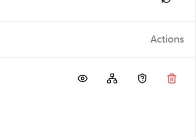
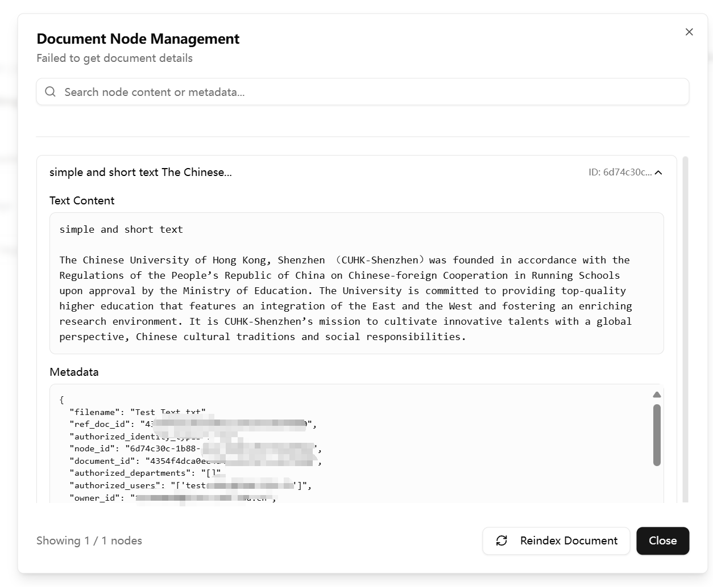
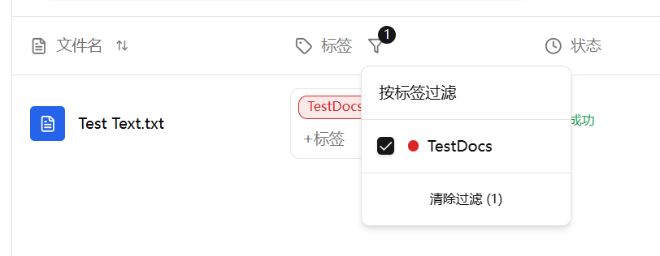

# In-depth Analysis: Document Content Viewing and Node Optimization Guide

Welcome, Senior Administrator!

When you upload a document, the system doesn't just store it. To enable AI to answer questions quickly and accurately, the system "digests" and breaks down the document into many independent **"Knowledge Nodes" (Node)**.

This manual will delve into this core concept, teaching you how to view the content parsed by the system, how to understand and edit these knowledge nodes, and how to significantly improve the AI's question-answering quality by optimizing them. This is an advanced technique, especially useful when you find the AI's answers unsatisfactory.

---

## 1. How to View Document Content and Nodes?

First, you need to enter the knowledge base management interface and find the "Document List" tab.

In the document list, for each document, the last operation column has several core function icons.

### Step One: View Document Parsing Content

Click the **eye icon** (View) to preview the plain text content parsed by the system from the original file.

*   **This is the original text that AI "sees"**. Please be sure to check the accuracy of this content. If the text here appears garbled, missing, or incorrectly formatted, the AI's learning effect will inevitably be greatly reduced. This is the first stop for troubleshooting.

### Step Two: Enter the Node Editor

Click the **network icon** (Edit Node) to enter the "Knowledge Node Editor" for this document. This is the main battlefield for fine-grained optimization.

---

## 2. Core Concept: What is a Knowledge Node?

### A Simple Analogy

If the document you uploaded is a **book**, then a knowledge node is like a **key paragraph, a note, or a core concept** that AI extracts from this book.

The system automatically divides a long document into several such small units, making it easier for AI to retrieve information when answering questions.

### Why Node Quality is Crucial?

When a user asks a question, AI does not read the full text of every relevant document. Its workflow is:
1.  **Retrieval**: Quickly find the few nodes most relevant to the question from a vast amount of knowledge nodes.
2.  **Generation**: Based on the content of these nodes, combined with the user's question, organize the language and generate the final answer.

Therefore, if the quality of the nodes themselves is not high (e.g., incomplete content, irrelevant information), then the "raw materials" found by AI will be flawed, and the final generated answer will naturally be unsatisfactory.

### What Makes a "Good" Node?

A high-quality knowledge node usually has the following characteristics:

*   **Topic-focused**: A node should only discuss a relatively independent and complete topic. For example, a node about "annual leave policy" should not include information about "reimbursement procedures."
*   **Self-contained context**: The node content should be self-explanatory, meaning it can be understood without relying on immediately preceding or following text. AI treats each node independently during retrieval.
*   **Concise and clear**: Remove colloquialisms, repetitive, or meaningless words, retaining core information.

---

## 3. How to Edit and Optimize Nodes?

In the node editor, you can see a list of all nodes into which the document has been cut.

1.  Click any node to expand and view its detailed content.
2.  Click the "Edit Node" button to enter edit mode.

### Edit Node Text

In the "Text Content" editing box, you can make the following optimizations:

*   **Correct errors**: Modify OCR recognition errors, typos, or formatting issues.
*   **Enhance relevance**: Delete sentences unrelated to the node's topic, or split a node containing multiple topics (manually copy content to other nodes or create new ones).
*   **Supplement context**: If you find that a node's meaning is incomplete due to splitting (e.g., a sentence is cut in half), you can manually complete it.

> If the PDF document contains web links
> AI may not be able to output links correctly due to document recognition errors, requiring manual correction.

### Save Your Changes

After editing, click the "Save" button. Your changes will take effect immediately and update the AI's knowledge base. The next time a relevant question is asked, AI will use your optimized new node content.

---

## 4. Using Tags for Categorization and Management

In addition to optimizing content, you can also add **Tags** to documents for easier categorization, filtering, and management in the document list.

**Key points**:
*   **Tags are for management only**: Tags are metadata whose primary purpose is to help you organize and find documents. They **do not** in any way affect the AI's retrieval logic or answer content.
*   **Global consistency**: Within a knowledge base, all tags are globally consistent. When you change the name or color of a tag, all documents using that tag will be updated synchronously.

### How to Manage Tags?

On the "Document List" page, you can see the tag bar for each document.

*   **Add Tags**:
    1.  Click the input area of the tag bar.
    2.  Directly enter the name of the new tag, then press `Enter` to create and add it.
    3.  You can also enter keywords and select one from the existing tag list to add.

    

*   **Remove Tags**:
    *   Hover your mouse over the tag you want to remove. An `x` icon will appear on the right side of the tag. Click it to remove it from the current document. This will not delete the tag itself.

    

*   **Edit Tags**:
    *   Directly click an already added tag, and an editing window will pop up.
    *   You can modify the tag's **name** and **color**.
    *   Please note that this modification is **global**. For example, if you change the color of the "Finance" tag from blue to red, then the tag color of all documents with the "Finance" tag in the knowledge base will change to red.

    

### Support for Filtering Documents by Tags

---

## 5. "Edit Node" vs "Re-index": How to Choose?

In the node editor, there is also a very powerful feature: "Re-index". Understanding its difference from "Edit Node" is crucial.

*   **Edit Node (Fine-tuning)**
    *   **When to use?** Use when the overall document segmentation is good, and only individual nodes have minor flaws (e.g., typos, incomplete sentences).
    *   **Effect**: Only modifies the node you edited, does not affect other nodes. It's like attaching an errata sticky note to a page in a book.

*   **Re-index (Redo)**
    *   **When to use?** When you find that the node segmentation effect of the entire document is very poor. For example, all nodes are too long or too short, or sentences are largely cut in the middle. You need to adjust the chunk size and the number of overlapping words between node blocks.
    *   **Effect**: **Deletes all old nodes of the current document**, and then, based on the new parameters you set in "Advanced Configuration" (e.g., knowledge block size), re-executes the entire segmentation and indexing process from the original file. This is equivalent to re-binding a book.

> **Conclusion**: First try "Edit Node" for fine-tuning. If you find that the problem is systemic and widespread, then consider using "Re-index" to solve the problem fundamentally.

---

## 6. Troubleshooting: When AI Answers are Poor

If you find that AI's answers are inaccurate, missing information, or fabricating facts, you can follow these steps to troubleshoot and optimize:

1.  **Check the original text**: First, use the "View Document" function to confirm whether the text content parsed by the system is accurate. If there is a problem with the original text, you need to re-upload a correct document.
2.  **Check the nodes**: If the original text is correct, enter the "Node Editor" and check the nodes related to the question.
    *   Did AI find the correct nodes?
    *   Is the content of these nodes clear and complete?
    *   Is there a situation where node segmentation is unreasonable, leading to key information being split into two or more nodes?
3.  **Try optimizing**:
    *   For problematic nodes, try using the "Edit Node" function to correct them.
    *   If you find that most nodes have segmentation issues, you can try using the "Re-index" function. In the advanced configuration that pops up, you can appropriately **reduce the "Knowledge Block Size (Chunk Size)"** to make each node contain more focused information, which can sometimes improve the effect.
4.  **Test the effect**: After optimization, return to the "Retrieval Test" page of the knowledge base, ask the same question again, and check the optimization effect.

Through the above methods, you will be able to more deeply control the operation of the knowledge base and maximize the potential of the AI assistant.