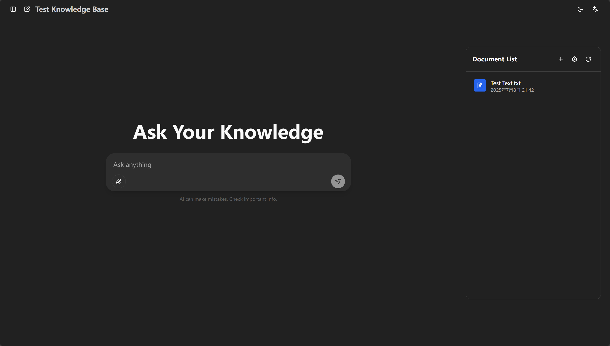
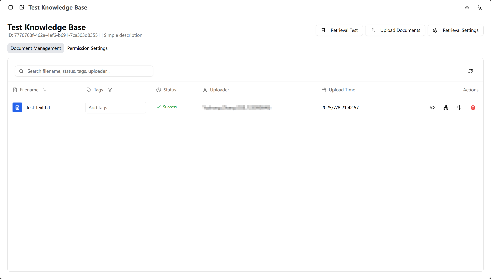
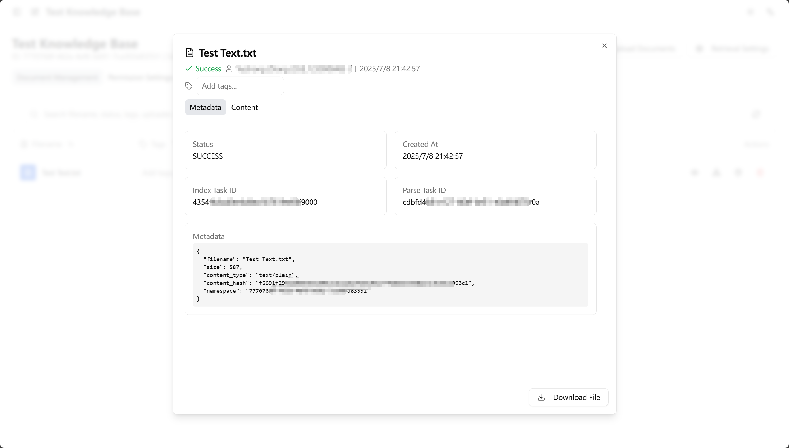
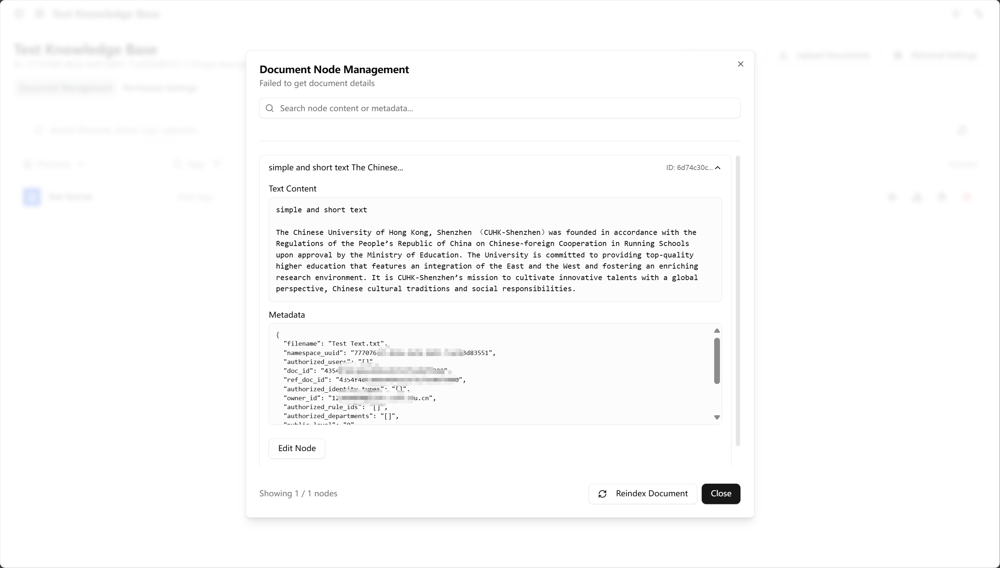
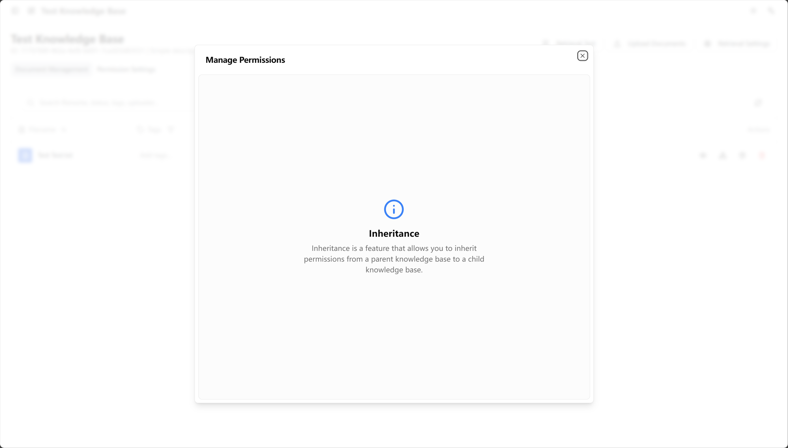
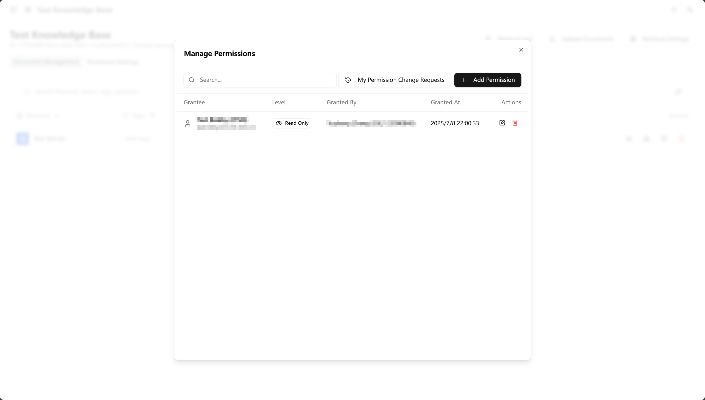

<!-- docs/docs/en/knowledge/index.md -->
# Knowledge Base Administrator Operations Manual

This manual provides standardized operational guidelines for the Knowledge Base Management System, designed to ensure system administrators can standardly and efficiently execute knowledge base management responsibilities.

## Manual Scope

This operations manual applies to system users with knowledge base management permissions, including the following roles:

- **Knowledge Base Owner (Owner)**: Core users responsible for knowledge base creation and management
- **Knowledge Base Administrator (Admin)**: Users authorized to manage specific knowledge base management affairs  
- **Department Knowledge Manager**: Full-time personnel responsible for department-level knowledge base maintenance and management
- **Site-wide Knowledge Base Administrator**: Senior management personnel with system-level knowledge base management permissions

## System Access Instructions

System function access is controlled by permissions. If you encounter situations where you cannot access relevant function pages, it is usually based on the following reasons:

- **Permission restrictions**: Knowledge base functions are currently only open to department knowledge base administrators
- **Permission requirements**: Complete function access requires corresponding levels of knowledge base management permissions

This manual aims to provide complete guidance for standardized operations of the knowledge base system, assisting management personnel in mastering standard management methods for department knowledge bases and enterprise regulations, establishing standardized operational processes for various application scenarios.

---

---

## 1. Knowledge Base Overview

The knowledge base serves as the core intelligent document management unit within the system, supporting users in incorporating various documents into unified management. The system provides intelligent Q&A services based on document content through automated document processing mechanisms combined with AI conversation capabilities.

### Knowledge Base Creation Standards

1.  Click the "Create Knowledge Base" button in the left navigation bar.
2.  Enter a standardized **Name** (e.g., "ITSO FAQ Knowledge Base") and an optional **Description**.
3.  Click confirm to complete creation. Upon successful creation, you will automatically become the **Owner** of this knowledge base.

> **Note**: Should modification of the knowledge base name or description be required, you may return to the knowledge base list and click the "More" (...) button on the card to perform edits.

### System Interface Architecture

The knowledge base system provides two core functional interfaces: the **Q&A interface** for daily interactive operations, and the **Management interface** for in-depth configuration management.

#### Q&A Interface Functionality
After creating a knowledge base, the system will automatically enter the **Q&A interface**. This interface is used for real-time interaction with the knowledge base. After you upload documents, you can perform Q&A operations in this interface.

The right side of the interface provides **file list** functionality, displaying successfully processed documents, facilitating quick viewing and management by users.

#### Management Interface Access
To configure the knowledge base in detail, please click the **gear icon** above the file list to enter the management interface.

---

## Content Management

### Document Management Standards

The core value of a knowledge base lies in its content management capabilities. Users can upload documents directly in the **Q&A interface**, or in the "Upload Document" tab of the **Management interface**.

#### Supported File Formats
The system supports multiple file formats for document processing:
-   **Documents**: `.pdf`, `.docx`, `.txt`, `.md`, `.html`
-   **Spreadsheets**: `.xlsx`
-   **Presentations**: `.pptx`
-   **Images**: `.png`, `.jpg`, `.jpeg`, `.bmp`, `.heic`, `.tiff` (supports text recognition)
-   **Data**: `.json`

#### Document Processing Status Description
After uploading, the system will display corresponding processing status for each file:
*   **Processing**: The system is currently learning and analyzing the document content.
*   **Success**: The document has been successfully processed and included in the retrieval library, available for intelligent Q&A.
*   **Failed**: An exception occurred during document processing. Users can enter the "Document List" in the management interface, locate the file, and perform "Re-index" operation.

### Management Dashboard Overview

After entering the management interface, you will see several core function tabs:

*   **Document List**: This shows all documents uploaded to your library and their detailed status.
*   **Permission Management**: Here, you can precisely control who can access your knowledge base and what they can do.
*   **Retrieval Test**: Here you can test the knowledge base's Q&A effectiveness with different retrieval parameters.
*   **Upload Document**: Here you can upload new documents.
*   **Knowledge Base Settings**: Here, you can modify the basic information of the knowledge base, AI's answer style, retrieval methods, and other advanced configurations.

### Document List Details: View, Edit, and Authorize
In the "Document List" tab, you can see detailed information for all uploaded documents. For each document, you can perform the following core operations:

From left to right, the functions of the three operation buttons are:

#### 1. View Document

Clicking this allows you to view the document's metadata and parsed content in detail. This is also the original data that AI uses for learning and retrieval.
*   **Content Accuracy**: If the parsed content is found to be incorrect, it may affect AI's understanding and answer quality.
*   **Download Original**: Click the "Download" button at the bottom of the pop-up to directly get your uploaded original file.

#### 2. Edit Nodes and Re-index

This is the core of knowledge base retrieval. To achieve intelligent retrieval, the system automatically divides each document into several **"knowledge nodes"**. When answering questions, AI first finds the most relevant nodes and then generates answers based on the content of these nodes.
*   **Re-index**: If document processing fails or content is updated, you can click the "Re-index" button in this interface to make the system re-learn this document.

#### 3. Document Permission Management

Here you can set independent access permissions for a **single document**. Detailed permission management strategies will be introduced in the next chapter.

---

## 3. Permission System: Who Can View, Who Can Edit

This is one of the most core functions of the knowledge base. Through flexible permission configuration, you can ensure that the right people access the right information in the right scenarios.

### Understanding the Four Permission Levels

From highest to lowest, permissions are divided into four levels. Higher levels automatically include all capabilities of lower levels.

| Permission Level | Core Capabilities | Common Explanation |
| :--- | :--- | :--- |
| **Admin (Administrator)** | Manage document authorization | **Manager** can manage documents, configurations, and most importantly, can manage user permissions. |
| **Read-Write** | Upload/modify documents and tags | **Contributor/Editor** can add and modify content to the knowledge base. |
| **Read** | View and download original documents | **Visitor** can browse all documents in the knowledge base, like browsing a library. |
| **Retrieve** | **Cannot view document list**, but can search content via AI assistant | **Questioner** doesn't even know this knowledge base exists, but in a global search, if content is relevant, AI will find answers for them here. |

> Permission hierarchy:
> Admin (Administrator) > Read-Write > Read > Retrieve

**Key difference**: Users with "Read" permission can see the knowledge base and all its files, while users with "Retrieve" permission cannot, but its content can be "remotely" called by the AI assistant to answer questions.

### How to Grant Permissions

In the "Permission Management" tab of the knowledge base, you can grant permissions to different individuals or groups:

1.  **Grant to individual**: Directly enter the recipient's IT account (UPN/email) and grant specific permissions. Suitable for individual authorization scenarios.
2.  **Grant to department**: Select a department (e.g., "Finance Department"), and all members of that department will automatically gain corresponding permissions. Suitable for internal departmental knowledge sharing.
3.  **Grant to specific identity**: Select an identity (e.g., "All Students", "All Faculty and Staff") for batch authorization.
4.  **Grant to composite rule (Advanced)**: You can create very precise rules, such as granting permissions to "all enrolled undergraduates in Shenzhen campus". This is a powerful tool for implementing complex permission control.

### Core Feature: Permission Inheritance

In "Knowledge Base Settings", there is a **"Permission Inheritance"** switch, which is enabled by default.

*   **Inheritance enabled (recommended)**: This is the "once and for all" mode. Permissions you set at the knowledge base level will automatically apply to **every** document within the library. It's very simple to manage.
*   **Inheritance disabled**: This is the "fine-grained control" mode. When disabled, you can set permissions for a **specific document** within the knowledge base that are completely different from the entire library. For example, the entire knowledge base is open to the department, but one confidential document is only open to a few people.

---

## 4. (Site-wide Administrator) Approval Center

For system security, when an ordinary knowledge base owner (not a site-wide administrator) attempts to perform large-scale authorization (e.g., authorizing an entire department or all students), the operation will not take effect immediately, but will create an **approval request**.

**Site-wide Knowledge Base Administrator**:
1.  See these pending approval requests in the management backend.
2.  Carefully review the reasonableness of the request.
3.  Choose to **"Approve"** or **"Reject"**. Permissions will only take effect after approval.
4.  For already approved permissions, if problems are found later, you can also **"Revoke"** them at any time.

---

## 5. Frequently Asked Questions (FAQ)

*   **Q: As a site-wide administrator, why can't I see all knowledge bases in the system on the left sidebar?**
    *   **A:** This is to prevent your sidebar from being overwhelmed by hundreds or thousands of knowledge bases, causing unnecessary interference. Your sidebar will only display knowledge bases you own or have been explicitly granted access to, just like a regular user. You can search and manage any knowledge base from the "Knowledge Base Management" homepage.

*   **Q: What is the difference between "Read" and "Retrieve" permissions?**
    *   **A:** A good analogy is a library.
        *   **Read** permission is like giving you a reading pass, you can walk into the library and browse any book on the shelf.
        *   **Retrieve** permission is like asking a librarian a question. The librarian will give you a precise answer based on all the books they have read, but you cannot enter the stacks yourself to browse those books. This permission is crucial for allowing the global "Campus Assistant" to draw on a wide range of knowledge.
