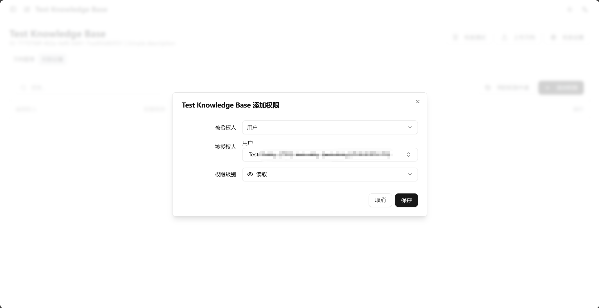

<!-- docs/docs/zh/knowledge/permission-guide.md -->
# Knowledge Base Permission Management Guide

Welcome to the Knowledge Base Permission Management Guide. This guide will help you deeply understand and skillfully apply the knowledge base's fine-grained permission system, ensuring that your knowledge assets are conveniently shared while receiving enterprise-level security protection.

---

## 1. Understanding Permissions: Hierarchical Model of Knowledge Base and Documents

To achieve flexible access control, the system has designed a permission hierarchy for **Knowledge Base (Namespace)** and **Single Document (Document)** that is both related and independent. Understanding the distinction between the two is fundamental to fine-grained management.

### A. Five Levels of Knowledge Base Permissions

The knowledge base, as the top-level container, has five permission levels. Higher levels automatically include all capabilities of lower levels.

| Permission Level | Core Capabilities | Common Explanation |
| :--- | :--- | :--- |
| **Owner** | Full control over resources, **can transfer knowledge base, is the only role that can designate `Admin`** | **Founder/Owner**. Has the highest, absolute permission over the knowledge base. Each knowledge base has only one Owner. |
| **Admin** | Authorization management, modify configuration, delete resources | **Manager**. Can manage the daily operations of the knowledge base, including managing content and user permissions, but cannot transfer the knowledge base. |
| **Read-Write** | Upload/modify document content, manage tags | **Contributor/Editor**. Can add and modify content in the knowledge base. |
| **Read** | View and download original documents, retrieve within the knowledge base | **Visitor**. Can browse all documents in the knowledge base, like browsing a library. |
| **Retrieve** | **Cannot view document list**, but can search content via AI assistant | **Questioner**. They don't know this knowledge base exists, but in a global search, AI will find answers from here. |

> Permission hierarchy:
> `Owner` > `Admin` > `Read-Write` > `Read` > `Retrieve`

### B. Four Levels of Single Document Permissions

For each independent document in the knowledge base, four permission levels can be set.

| Permission Level | Core Capabilities |
| :--- | :--- |
| **Admin** | Independent authorization management for this document. |
| **Read-Write** | Modify this document's nodes/tags, re-index. |
| **Read** | View the full text of this document, nodes, download original. |
| **Retrieve** | Content can be retrieved by AI assistant. |

**Key difference**: Single documents **do not have the concept of `Owner`**. `Admin` is the highest permission that can be granted on a single document. The final permission of a document depends on **whether the knowledge base has enabled permission inheritance**, which we will explain in detail in Section 5.

**Key difference: "Read" vs. "Retrieve"**

This is one of the most important distinctions to understand in the permission system:
*   **Read** permission is like giving someone a reading pass, they can walk into this knowledge base "library" and browse any book on the shelf.
*   **Retrieve** permission is more like asking a librarian. The librarian will give a precise answer based on their extensive knowledge of books, but the questioner cannot enter the stacks themselves to browse those books. This permission is crucial for allowing the global "Campus Assistant" to draw on a wide range of knowledge and gather information from across the campus without revealing the documents themselves.

---

## 2. Permission Details: What Can Each Level Do?

To help you understand the specific capabilities of each permission level more clearly, we will explain the operations in detail, divided into "knowledge base level" and "document level."

### A. Operations Permissions at the Knowledge Base Level

*   **`Owner` can**:
    *   Perform all `Admin` operations below.
    *   Appoint or remove `Admin` for the knowledge base.
    *   Transfer ownership of the knowledge base to other users.
*   **`Admin` can**:
    *   Perform all `Read-Write` operations below.
    *   Modify the knowledge base's name, description, permission inheritance mode, and retrieval configuration.
    *   Grant `Read-Write`, `Read`, `Retrieve` permissions of the knowledge base to other users.
    *   Delete the entire knowledge base.
*   **`Read-Write` can**:
    *   Perform all `Read` operations below.
    *   Upload new documents to the knowledge base.
    *   Re-index the entire knowledge base.
*   **`Read` can**:
    *   Perform all `Retrieve` operations below.
    *   See this knowledge base in the left sidebar.
    *   Test in the "Retrieval Test" function of the knowledge base.
    *   View and download all documents (that you have permission to view) within the knowledge base.
*   **`Retrieve` can**:
    *   Allow the global AI assistant to retrieve content from this knowledge base when answering questions.

### B. Operations Permissions at the Document Level

These are permissions for operating on single documents within the knowledge base. Please note that whether these operations can be performed also depends on whether the knowledge base has disabled "permission inheritance."

*   **With `Admin` permission for a document, you can**:
    *   Perform all `Read-Write` operations below.
    *   Authorize or de-authorize this independent document.
*   **With `Read-Write` permission for a document, you can**:
    *   Perform all `Read` operations below.
    *   Modify the content nodes and tags of this document.
    *   Re-index this document.
*   **With `Read` permission for a document, you can**:
    *   Perform all `Retrieve` operations below.
    *   View and download the original text of this document.
    *   View the parsed content nodes and tags of the document.
*   **With `Retrieve` permission for a document, you can**:
    *   Allow the global AI assistant to retrieve content from this document when answering questions.

---

## 3. Default Permission Behavior and Overlay Rules

To ensure that the permission system behaves intuitively, the system follows two simple but important basic principles:

### A. What You See Is What You Get (WYSIWYG)

The system's permissions are explicit. Whatever permissions you grant to a user or user group, they will have exactly that capability, no more, no less. There are no hidden or implicit permission rules.

### B. When Permissions Overlap, Take the Highest Level

In practical scenarios, a user may be granted permissions to the same resource through multiple channels. For example, a user is both a member of the "IT Department" (granted `Read` permission) and individually granted `Read-Write` permission.

**In this case, the system will always adopt the highest permission level the user possesses.**

*   **Example**:
    *   The knowledge base "IT Operations Manual" grants **`Read`** permission to the entire "IT Department."
    *   The knowledge base also individually grants **`Read-Write`** permission to user "Zhang San" (who is a member of the IT Department).
    *   **Final result**: Zhang San has **`Read-Write`** permission for the "IT Operations Manual" because it is the highest permission granted to him.

---

## 4. Authorization Methods: How to Grant Permissions to Others

The system provides powerful and flexible authorization mechanisms, allowing you to grant permissions to different types of objects.

1.  **Grant to individual (`USER`)**
    *   **Method**: Directly enter the recipient's IT account (UPN/email).
    *   **Applicable scenarios**: Granting permissions to specific individuals, such as project collaborators, temporary content reviewers.

2.  **Grant to department (`DEPARTMENT`)**
    *   **Method**: Select a department from the list, such as "Finance Department," "IT Service Desk."
    *   **Applicable scenarios**: Internal departmental knowledge sharing, all department members will automatically gain corresponding permissions.

3.  **Grant to specific identity (`IDENTITY_TYPE`)**
    *   **Method**: Select a predefined identity type, such as "All Students," "All Faculty and Staff."
    *   **Applicable scenarios**: Content publishing for large-scale groups with common identity characteristics.

4.  **Grant to tag (`TAG`)**
    *   **Method**: Authorize based on tags set for users in IT-Tools.
    *   **Applicable scenarios**: Suitable for flexible grouping across departments and identities, such as "Core Project Team Members," "Shenzhen Campus New Student Counselors," etc.

5.  **Grant to composite rule (`ITTOOLS_RULE`) - (Advanced Feature)**
    *   **Method**: This is the most powerful authorization method. You can customize a set of "AND/OR" rules to combine multiple user attributes (e.g., department, campus, student category, job level) for extremely precise permission control.
    *   **Example**: Create a rule to grant permissions to "all enrolled undergraduates in Shenzhen campus, School of Computer Science."
    *   **Impact estimation**: For rule-based authorization, you can also estimate how many users the rule will affect to avoid incorrect authorization scope.

---

## 5. Core Mechanism: Permission Inheritance (Enabled vs. Disabled)

"Permission Inheritance" is the core switch for knowledge base permission management, determining the permission relationship between the knowledge base and its internal documents. You can find and change it in "Knowledge Base Settings."

| Comparison Dimension | ✅ **Inheritance Enabled (Default Mode)** | ❌ **Inheritance Disabled (Independent Mode)** |
| :--- | :--- | :--- |
| **Management Mode** | **Unified management, once and for all** | **Fine-grained control, configure individually** |
| **Permission Relationship** | Document permissions **always** remain consistent with the knowledge base. | Knowledge base and document permissions are **completely decoupled**. |
| **How to Operate** | Only need to grant permissions at the knowledge base level. | Can grant permissions separately at the knowledge base and on each document. |
| **Impact on New Documents** | Newly uploaded documents automatically inherit the knowledge base's **current** permissions. | New documents **initially copy** the knowledge base's current permissions, but can then be **independent modified**.
| **Applicable Scenarios** | **Most cases**. Suitable for knowledge bases with unified permissions for departments, projects, etc. | Knowledge base contains **a few highly sensitive** documents that require stricter independent control. |

### ✅ Inheritance Enabled Mode (Recommended)
This is the most common and simplest management method.
*   **Behavior**: Any permission changes you make at the knowledge base level – such as granting "Read" permission to the "Marketing Department" – will be immediately and **automatically synchronized** to **all documents** under that knowledge base.
*   **Example**: You grant "Read" permission to Zhang San for Knowledge Base A, then Zhang San can read all documents in Knowledge Base A. If you later revoke Zhang San's permission, he will simultaneously lose access to all documents.

### ❌ Inheritance Disabled Mode
When you need to set special permissions for individual documents, should use this mode.
*   **Behavior**: When inheritance is disabled, knowledge base permissions and document permissions become parallel lines. You can manage the permissions of each document independently, without being affected by the knowledge base's permission settings.
*   **Example**:
    1.  Knowledge Base B grants "Read-Write" permission to the entire "IT Department."
    2.  You disable permission inheritance for Knowledge Base B.
    3.  Now, you can:
        *   Individually grant "Read" permission for document `B-1.docx` to Li Si, even if Li Si is not in the IT Department.
        *   Set the permission for document `B-2.pdf` (a sensitive report) so that only Wang Wu (`Admin`) can access it, and no one else in the IT Department can see it.
*   **Regarding new documents**: In this mode, when you upload a new document, the system will first **copy** the knowledge base's permissions to the new document for convenience. However, after that, the document's permissions become independent, and you can modify them at any time; they will no longer change with the knowledge base's permissions.

> **Best Practice**: Unless you have a very clear scenario that requires fine-grained permission control over individual documents, it is **strongly recommended to always keep "Permission Inheritance" enabled**. This will make your permission management much easier.

---

## 6. Approval Process: Safety Valve for Large-scale Authorization

To prevent large-scale misuse of permissions, the system has set up a security approval process for some high-risk authorization operations. As a knowledge base administrator, when you perform such operations, you need to submit an application and wait for approval.

*   **What operations require me to submit for approval?**
    1.  **Request for rule-based authorization**: Any attempt to grant permissions based on "department," "identity type," "tag," or "composite rule."
    2.  **Request exceeding authorization limit**: When the number of "individual authorizations" you add to a single knowledge base exceeds the system limit (default is **20**).

*   **Restrictions on submitting for approval**
    *   To prevent abuse, each user can have a maximum of **10** applications in "pending approval" status. Once this limit is reached, you need to wait for existing applications to be processed before submitting new ones.

*   **What is the approval process?**
    1.  When you submit an authorization that requires approval, the permission **will not take effect immediately**, but an "pending approval" application record will be generated.
    2.  Your application will be reviewed by the **system's site-wide administrator**.
    3.  Permissions will only take effect after approval; if rejected, the permissions will not take effect.

*   **How to track my application?**
    *   You can click the **"My Applications"** button on the "Permission Management" page of the knowledge base.
    *   In the pop-up window, you can view all your submitted application records and their current approval status (pending approval, approved, rejected).

---

## 7. Knowledge Base Owner and Administrator (`Owner` & `Admin`)

As managers of the knowledge base, `Owner` and `Admin` are the two most core roles.

*   **`Owner`** is the creator or transferee of the knowledge base. They are the highest controller of the knowledge base, possessing unique permissions, such as appointing `Admin` or transferring knowledge base ownership to others. Each knowledge base can only have one `Owner`.

*   **`Admin`** is designated by the `Owner` and is the daily operations officer of the knowledge base. They have all management capabilities except for the `Owner`'s exclusive permissions, such as configuring the knowledge base, managing content, and granting `Read-Write` and below permissions. A knowledge base can have multiple `Admin`s.

---

## 8. Practical Operation: Granting Permissions Step-by-Step

1.  Enter the knowledge base you manage, click the gear icon in the upper right corner, and enter the **Management Interface**.

2.  Switch to the **"Permission Management"** tab.
3.  Click the **"Add Rule"** button to open the authorization pop-up.

4.  In the pop-up, select in order:
    *   **Authorization Type**: Whether to grant to an individual, department, or other type.
    *   **Authorization Object**: Enter the username or select the corresponding department/identity.
    *   **Permission Level**: Select `Admin`, `Read-Write`, `Read`, or `Retrieve`.
5.  Click **"Save"**. If your operation requires approval, the system will prompt you that the request has been submitted.
6.  After successful authorization, the new rule will appear in the list. You can click the **Edit** or **Delete** icon on the right side of the rule at any time to modify or revoke the permission.
