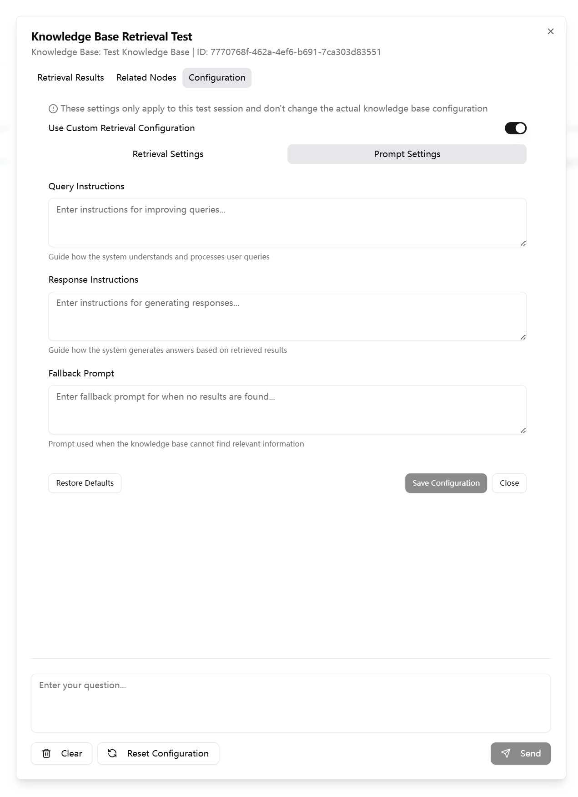
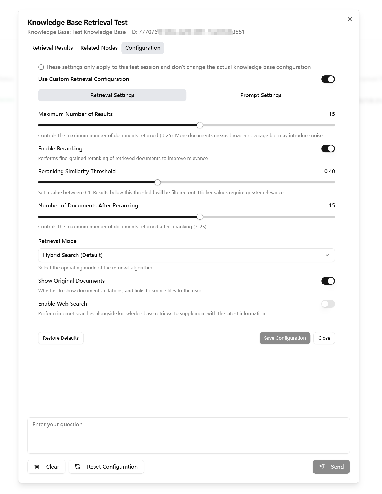

# Expert Guide: Optimizing AI Answers through Prompts and Retrieval Parameters

Welcome, Knowledge Base Tuning Expert!

Have you ever encountered a situation where the AI's answer was unsatisfactory, even though the document contained relevant content? Or perhaps the AI's answer style is always monotonous and doesn't meet your requirements?

This advanced guide will unveil the mystery behind AI Q&A, teaching you how to use the **"Retrieval Test"** function to fine-tune your knowledge base AI into a truly understanding and business-savvy expert assistant by precisely adjusting **Prompts** and **Retrieval Parameters**.

---

## 1. Understanding How AI Works

Before optimizing, we must first understand how AI thinks.

### What Information Can AI See?

When answering any of your questions, AI does not imagine out of thin air. All information sources it can refer to include:
*   **Basic information of the knowledge base**: The **name** and **description** of the knowledge base.
*   **User's "input"**: The user's current message, and previous **conversation history (context)**.
*   **Reference document information**: The content of the documents you uploaded.
*   **Administrator's prompts**: The **Prompts** you set for it at various stages.

### How Does AI Answer Questions?

A seemingly simple Q&A, AI roughly takes three steps in the background:

1.  **Initial Rewriting and Search**: AI first combines the context and your set "retrieval prompt" to rewrite the user's original question into a query more suitable for machine search, and then performs an initial search in the knowledge base.
2.  **Secondary Rewriting and Refined Search**: Based on the first round, more complex secondary rewriting and precise searching may be performed to lock down the most relevant knowledge nodes.
3.  **Integration and Answering**: Finally, AI integrates the searched content, combines it with your set "response prompt," organizes the language, and generates the final answer.

As an administrator, you don't need to worry about the complex intermediate processes. You only need to focus on **optimizing the prompts for these two stages of retrieval and answering** to fundamentally improve the effect.

---

## 2. Three Optimization Principles: Improving AI Effectiveness from the Root

Please keep in mind the following three core principles, which are the foundation of all optimization work.

### Principle One: Knowledge Base Description is Required

**The description of the knowledge base is crucial and indispensable!** This is the most basic and important global background you set for AI. A good description should clearly tell AI: "What is this knowledge base about?" This can greatly help AI frame the scope and understand proper nouns during retrieval.

### Principle Two: Write "Cheat Sheets" for AI with "Retrieval Prompts"

The core goal of **Retrieval Prompts (Query Instructions)** is to accurately map the user's "colloquialisms" to the "formal language" in your documents. You need to write a "cheat sheet" for AI here.

*   **Explain business terms**: Tell AI what common **abbreviations, aliases, and jargon** in business scenarios correspond to in the document.
    *   *Example*: "`"Leave slip" refers to "leave application form," and "annual leave" is usually called "annual paid leave" in documents.`"
*   **Provide association clues**: Guide AI to associate relevant entities and concepts based on user questions.
    *   *Example*: "`If the user asks about a certain process, they should associate it with the person in charge of the process, required materials, and deadlines.`"

### Principle Three: Precisely Shape Output with "Response Prompts"

**Response Prompts (Response Instructions)** determine the final presentation of AI. You need to clearly tell AI what you want, like a director.

*   **Specify format**: `Please answer in an unordered list`, `Please present in a table format`.
*   **Control length**: `Please keep the answer within 100 words`, `Please explain in as much detail as possible`.
*   **Define style**: `Please act as a senior technical support expert`, `Please answer in a lively, colloquial style`.
*   **Cite sources**: `You must cite the name of the source document you referenced at the end of the answer`.

---

## 3. Core Tool: Retrieval Test

In the "Management" interface of the knowledge base, find the "Retrieval Test" tab. This is your "laboratory" for all optimization work.

### Interface Overview

The "Retrieval Test" interface is mainly divided into three areas:
1.  **First tab: Configuration Area**
    *   Here you can enter test questions and adjust all prompts and retrieval parameters in real time.
2.  **Second tab: Retrieved Nodes View Area**
    *   This will display the final answer generated by AI based on your configuration and the referenced source knowledge nodes.
3.  **Third tab: Retrieval Configuration Area**
    *   Here you can fine-tune the retrieval parameters.

### The Art of Prompts

#### Query Rewriting Prompt (Query Instructions)
*   **Function**: Guides AI on how to "better understand" the user's original question, writing a "cheat sheet" for AI. (Refer to Principle Two)
*   **Example**: "`You are a smart IT help desk assistant. User's "meeting software" usually refers to Teams, and "VPN" refers to the company's Cisco AnyConnect. When users ask about account issues, they should associate it with password reset, two-factor authentication (MFA).`"

#### Response Generation Prompt (Response Instructions)
*   **Function**: Guides AI on how to "organize language and generate the final answer." (Refer to Principle Three)
*   **Example**: "`Please answer as a senior HR expert, using rigorous and professional language. If steps are involved, please use the 1, 2, 3 format. Finally, you must attach the referenced document source.`"

#### Fallback Prompt
*   **Function**: When AI **cannot find any relevant content** in the knowledge base, it will say this. Contact information can be added.
*   **Example**: "`Sorry, I couldn't find relevant information in the knowledge base. You can try rephrasing your question, or contact ITSO Help Desk at 0755 842-73333 for assistance.`"

### Fine-grained Control of Retrieval Parameters: An Art of Trade-offs

Adjusting retrieval parameters is like walking a tightrope, finding the best balance between "rather too little than too much" and "rather too much than too little."

*   **Core Parameter: Top K**
    *   **Function**: The first "preliminary selection" threshold, determining how many candidate nodes are initially filtered out.

*   **Quality Control: Rerank**
    *   **Rerank switch**: **Strongly recommended to keep enabled**, it will use a more precise model for secondary filtering.
    *   **Rerank Cutoff (Similarity Threshold)**: The "re-examination" score line. This is the parameter that **requires the most fine-tuning**.
    *   **Rerank Top K (Final Admission Count)**: The number of nodes ultimately used to generate the answer.

*   **The Art of Trade-offs: An Example**
    *   **Scenario**: Suppose there is a "service hall" knowledge base with a large number of documents.
    *   **Dilemma One**: If `Top K` is set too high (e.g., 25), it will recall a large amount of irrelevant "noise" documents, which will interfere with AI's final judgment.
    *   **Countermeasure at this time**: You may need to **increase `Rerank Cutoff`** (e.g., from 0.4 to 0.5) to make the filtering criteria stricter, leaving only the most relevant essential content.
    *   **Dilemma Two**: However, if `Cutoff` is set **too high**, some documents that are relevant but expressed slightly differently may be "mis-killed" because they just missed the score line, leading to AI lacking key information when answering.
    *   **Conclusion**: You need to find a "golden mean" that best suits the data distribution of your knowledge base through repeated testing.

*   **Mode Selection: Hybrid vs. Semantic**
    *   **Hybrid (Hybrid Mode)**: **Recommended default option**. Combines semantic understanding and keyword matching, with the most balanced effect.
    *   **Semantic (Semantic Mode)**: Purely relies on understanding "meaning" for retrieval, suitable for handling colloquial, non-keyword queries.

*   **Web Search Switch (Use Web Search)**
    *   **Function**: This is a powerful supplementary switch that determines whether AI is allowed to search for information from the public internet as a supplement when answering.
    *   **When to close (default)**: For business scenarios with stable, infrequently changing content (e.g., internal regulations, historical documents of specific projects), it is strongly recommended to close. This ensures that AI's answers strictly come from your uploaded authoritative documents, avoiding interference from external information and "hallucinations."
    *   **When to open**: For technical knowledge bases, or any scenario that requires combining external latest information and is not limited to campus information, consider opening. For example, asking about the latest usage of an open-source software, enabling web search can get more timely answers.

*   **Show Reference Switch (Show Reference)**
    *   **Important prerequisite**: This switch **does not control permissions**! It only affects the interface seen by users who **already have access** to the knowledge base. It will never allow unauthorized users to see the source document.
    *   **Function**: Determines whether AI should attach the link to the source document it referenced after generating the answer.
    *   **When to open (default recommendation)**: To facilitate authorized users to trace and verify information, it is recommended to keep it open. This is a good habit in most business scenarios and can improve the credibility of the answer.
    *   **When to close**: If you pursue an extremely concise conversation interface and do not want any additional links to interfere, or if the referenced source document itself has a messy layout and is not suitable for direct display, you can consider closing.

---

## 4. Practical Exercise: General Problem Troubleshooting Process

When AI answers incorrectly, please follow the standard process below for troubleshooting:

**Step One: Find the Target Document**
First, as an expert in this field, you should clearly know which document(s) contain the correct answer.

**Step Two: Reproduce in "Retrieval Test" Page**
Use the user's question, or a more standard question you think, to perform a test.

**Step Three: Analyze Retrieval Results**
This is the most crucial step. Check the source node list in the "Retrieved Nodes View Area" on the right:

*   **Case A: Successfully found the target document/node, but the final answer is incorrect**
    *   **Cause**: AI "saw" the correct material, but "misunderstood" the business scenario, or its "expression" ability was poor.
    *   **Solution**: The problem lies in the **prompts**. Go back and optimize the **"Query Rewriting Prompt"** (to help it understand better) or the **"Response Generation Prompt"** (to help it express better).

*   **Case B: Failed to find the target document/node**
    *   **Cause**: There are usually two possibilities.
    *   **Cause 1: Incorrect search keywords**. AI's rewritten query does not match the actual expression in the document.
        *   **Solution**: This is a typical case of a poorly written "cheat sheet." Optimize the **"Query Rewriting Prompt"** to establish a mapping between user's common language and document keywords.
    *   **Cause 2: Document is buried**. Relevant documents were squeezed out by other massive "noise" documents in the initial preliminary selection because their scores were not high enough.
        *   **Solution**: This is a typical parameter problem. Try **increasing the `Rerank Cutoff`** threshold to make the filtering stricter, thereby filtering out noise and allowing truly relevant documents to "surface."

---

## 5. Saving Your Results

> **⚠️ Important Note**
> All parameters you adjust on the "Retrieval Test" page are **only for this test**, are temporary, and will not be automatically saved!
>
> To make these optimizations permanently effective throughout the knowledge base, you must manually go to the **"Knowledge Base Settings"** page, find the corresponding configuration items, re-enter, and save these parameters.

Completing this step will truly apply all your efforts to the Q&A experience of all users.
