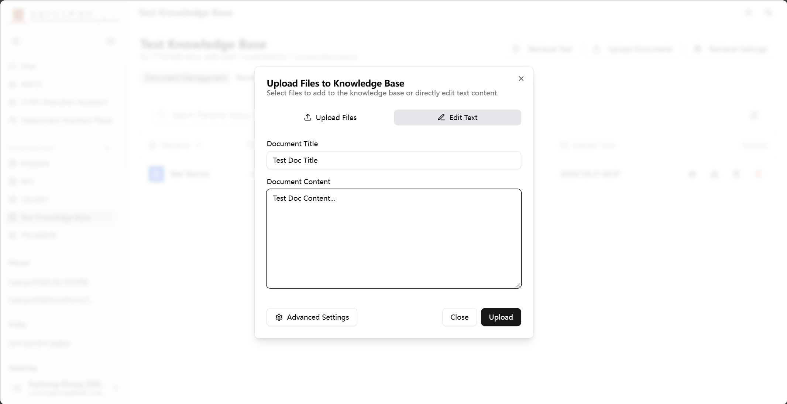

# Knowledge Base Document Upload Guide

This document will provide you with detailed instructions on how to upload content to the knowledge base, including different upload methods, supported file formats, and how to optimize AI's understanding and learning effectiveness of your documents through advanced parameters.

---

## 1. Upload Methods

The system provides two flexible content upload methods: directly uploading local files, or writing/pasting text in the editor.

### Method One: File Upload

This is the most commonly used method. You can batch upload single or multiple files from your local computer to the knowledge base.

1.  In the knowledge base Q&A interface, click the "Upload Document" button in the lower right corner.
2.  In the pop-up window, you can add files in any of the following ways:
    *   **Click to upload**: Click the area within the dashed box, and a file selection window will pop up, from which you can select files.
    *   **Drag and drop upload**: Directly drag and drop files or folders from your computer into the dashed box.
3.  After adding files, you can preview the files to be uploaded in the list below.
4.  Click the "Upload" button in the lower right corner to start the upload process.

### Method Two: Text Upload

If you want to quickly store a piece of text, an article, or an unformatted document in the knowledge base, you can use the text upload function.

1.  In the upload window, switch to the "Text" tab.
2.  In the "Title" input box, give your text content a name. This title will be used as the **file name** for this document in the knowledge base (e.g., `Meeting Minutes-20240709.txt`).
3.  In the editor below, write or paste your text content.
4.  When ready, click the "Upload" button in the lower right corner. The system will automatically package your text content into a `.txt` file and upload it along with other files.



---

## 2. Supported File Types and Recommendations

### Complete Format List

The system supports various mainstream file formats, covering most office and learning scenarios.

| Category | Supported Extensions |
| :--- | :--- |
| **Documents** | `.pdf`, `.docx`, `.txt`, `.md`, `.html` |
| **Spreadsheets** | `.xlsx` |
| **Presentations** | `.pptx` |
| **Images** | `.png`, `.jpg`, `.jpeg`, `.bmp`, `.heic`, `.tiff` |
| **Data Formats** | `.json` |

### Best Practice Recommendations


To ensure AI achieves the best learning results, we recommend choosing the most suitable format based on your document content:

*   **Pursuing highest text quality**: For Office formats (`.docx`, `.xlsx`, `.pptx`), the system can quickly and accurately extract plain text information with fewer errors, but it **cannot extract** images within them.
*   **Illustrated tutorials**: When images are as important as text in a document (e.g., operation step descriptions, product manuals), please be sure to **use PDF format**. The system can extract images from PDFs and display them to users when AI answers. However, please note that PDF processing speed will be slower than Office files.
*   **Structured plain text**: For plain text, code, or content with a fixed format, **Markdown (`.md`)** format is strongly recommended. It has a clear structure and is most easily understood by AI accurately.
*   **Scanned documents or images**: For scanned PDFs or images containing a lot of text, be sure to **enable OCR function** in advanced settings.
*   **Large tables**: When documents contain large, standardized tables, please ensure **"Table Optimization" is enabled"**, and that the table header is in the first row.

---

## 3. Advanced Configuration Parameters Explained

In the upload window, click the "Advanced Settings" button in the lower left corner to open the parameter configuration panel. These parameters determine how the system "reads" and "digests" your documents. Proper configuration can significantly improve Q&A effectiveness.

> **Tip**: If you are unsure how to configure, keeping the default settings is usually a safe and effective choice.

#### OCR
*   **Applicable files**: This function **only works for PDF files**.
*   **Function**: This is a "pure OCR" parsing mode. It ignores the original text layer in the PDF and forces image recognition on each page to extract text.
*   **Advantages**: For scanned documents (image-based PDFs without embedded text), this is the only effective text extraction method. For some PDFs with font embedding issues, it can also be an alternative, and parsing speed is relatively fast.
*   **Disadvantages**: This mode **cannot extract** any images from the PDF or preserve complex layout formats.

#### Force Large Model Parsing
*   **Function**: For some documents with exceptionally complex layouts (e.g., multi-column journal papers, design manuals with heavily intertwined text and images), standard parsing programs may struggle to accurately extract text. Enabling this option will call a more powerful AI large model for deep parsing, aiming for the highest text extraction accuracy.
*   **Disadvantages**: Processing speed will be significantly slower, costs will be higher, and this mode **cannot extract** image information from documents. Please only try this when standard parsing results are unsatisfactory.

#### Auto Split
*   **Function**: The system defaults to intelligently splitting a long document into multiple smaller, logically related "knowledge blocks" to enable AI to more precisely locate relevant content when answering questions.
*   **Important note**: Please be sure to keep this option enabled. If disabled, the system will **only extract the first 25 pages of the document**, and the rest will be ignored.

#### Table Optimization (Unwrap Table)
*   **Function**: When enabled, the system will specifically optimize the recognition of tables in documents. It will "unwrap" a two-dimensional table into a one-dimensional text more suitable for AI retrieval. For example, a table:
    ```
    | Fruit   | Price | Weight |
    | :---   | :--- | :--- |
    | Apple   | 2    | 7    |
    | Banana  | 5    | 4    |
    ```
    will be converted to text similar to:
    ```
    Fruit: Apple, Price: 2, Weight: 7
    Fruit: Banana, Price: 5, Weight: 4
    ```
    allowing AI to precisely query "weight of banana."
*   **Important limitation**: This function requires the table's **header to be in the first row**. If the table has no header, or the header is in another position, enabling this function may lead to worse parsing results.

#### Chunk Size
*   **Function**: This parameter defines the approximate number of words in each "knowledge block" during "auto split." It determines the size of the context window AI "reads" at a time during retrieval.
*   **How to adjust**:
    *   **Increase**: If your document content has strong coherence and often requires large chunks of context for Q&A, you can appropriately increase this value. However, this may sacrifice some retrieval accuracy.
    *   **Decrease**: If your document consists of many independent knowledge points, decreasing this value can improve retrieval accuracy, but may lead to insufficient context.
*   **Recommendation**: Non-professional users are advised to use the default value.

#### Chunk Overlap
*   **Function**: To prevent the loss of key information at the split point of knowledge blocks (e.g., in the middle of a sentence), there will be some overlapping content between adjacent knowledge blocks. This parameter defines the number of words in the overlapping part.
*   **Recommendation**: This value is usually 10%-25% of `Chunk Size`. Non-professional users are advised to use the default value.

---

## 4. Processing Flow After Upload

After you click upload, the document will go through a standardized processing pipeline. You can see its status changes in the upload list or document management page:

1.  **Pending**: The document has entered the processing queue, waiting for the system to allocate resources.
2.  **Parsing**: The system is extracting plain text and metadata from the document according to your configuration (e.g., OCR).
3.  **Indexing**: The system is chunking, vectorizing the parsed text, and storing it in a database searchable by AI.
4.  **Success**: Processing complete! The document content is now available for knowledge base Q&A and retrieval.
5.  **Failed**: An error occurred during processing. You can try reprocessing the document through "Edit Node" -> "Re-index" function.

---

## 5. Summary and Tips

*   **From default start**: First, upload using the system's default upload configuration, then test the effect in the Q&A interface. Only when the effect is not ideal, then adjust advanced parameters for re-indexing.
*   **Check parsed content**: After successful upload, you can go to "Management Interface" -> "Document List" in the knowledge base, click "View Document" or "Edit Node", check if the text content parsed by the system meets expectations. This is an important step in troubleshooting poor Q&A effectiveness.
*   **Divide and conquer**: For an extremely long document containing multiple completely different topics, consider manually splitting it into several independent documents before uploading. This helps improve retrieval accuracy.
