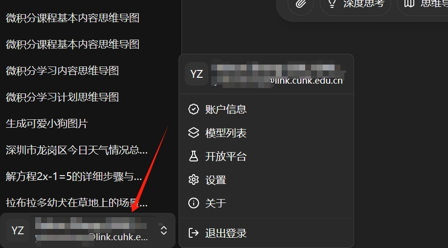
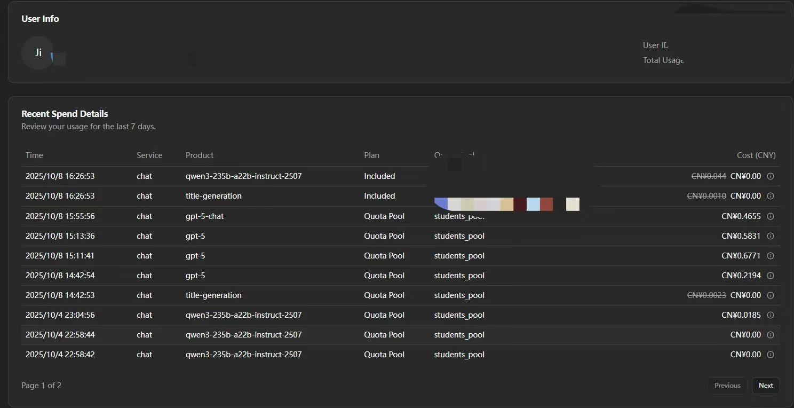
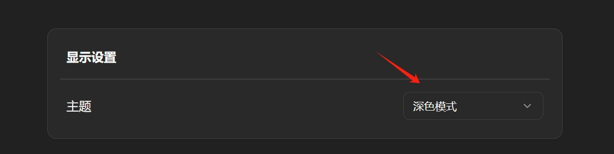
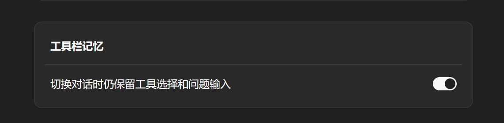
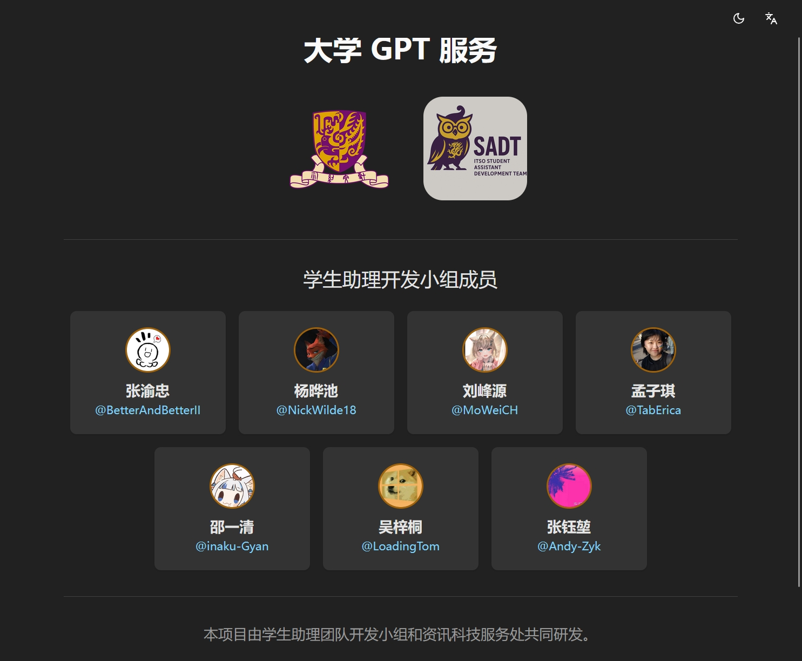
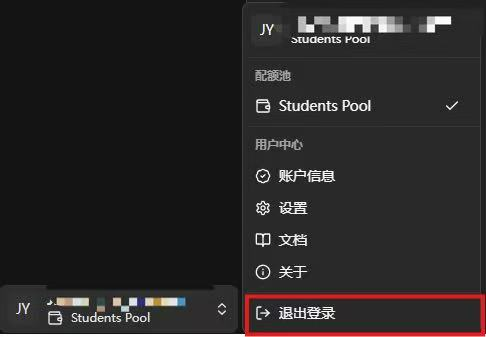

<!-- docs/docs/en/manual/account.md -->

# **User Center Guide**

!!! abstract "Overview"
    This page provides a comprehensive overview of the major large language models currently supported by the University GPT platform, including information on each model's provider, deployment method, key features, suitable use cases, response speed, and usage cost. This guide enables users to quickly understand the strengths and applicability of different models and select the most appropriate one based on their specific needs.

---

## :material-source-commit-start: Getting Started

- Click on your username below the history panel to open the user center menu. Select the desired function to access its detailed page.

---

## :material-wallet-plus: Account Information

- This page displays the user's personal information, token balance, and token usage statistics. The chart below shows your billing record in the last 7 days.

---

## :material-order-bool-descending-variant: Model List

- This page lists basic information for all models available to the current user, including provider, key features, recommended use cases, response speed, and usage cost.

## :material-wrench: Settings

- Clicking on `Settings` takes you to the GPT platform's basic configuration page.

### 1. Display Settings

- Use this option to switch between light and dark color themes (or use the :material-weather-sunny: / :material-weather-night: button in the top-right corner for quick toggling).

### 2. Auto-Scroll

- Enable or disable this option to control whether the page automatically scrolls to the bottom during model responses.

### 3. Toolbar Memory

- This setting determines whether tool calls and queries from the previous conversation are retained when switching between different chat tabs.

### 4. PDF Preview Settings

- When enabled, opening a single PDF file will automatically launch the PDF preview panel.

## :material-alert-box-outline: About

- This page provides information about the University GPT platform development team (the ITSO Student Assistant Development Team).

## :material-exit-to-app: Log Out

- Click `Log Out` to sign out of the current account.

