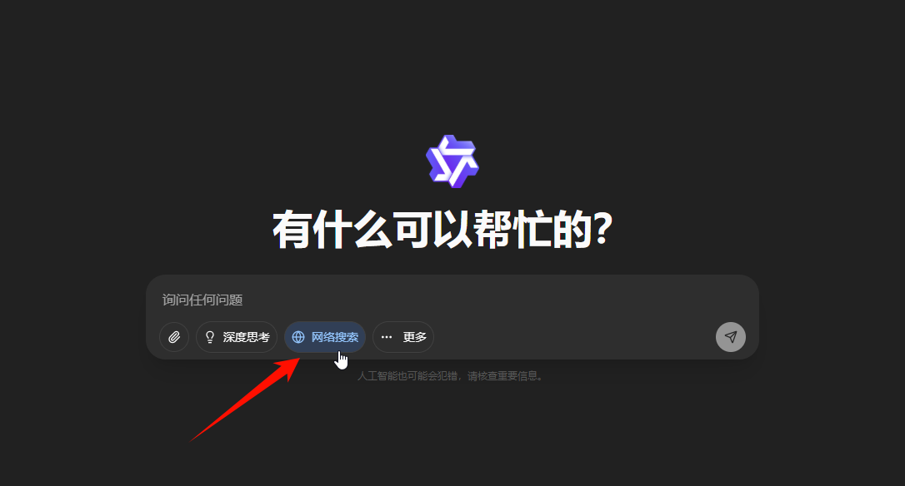
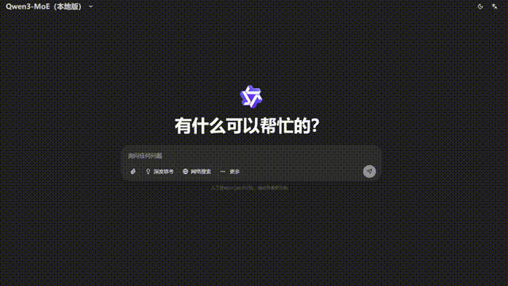
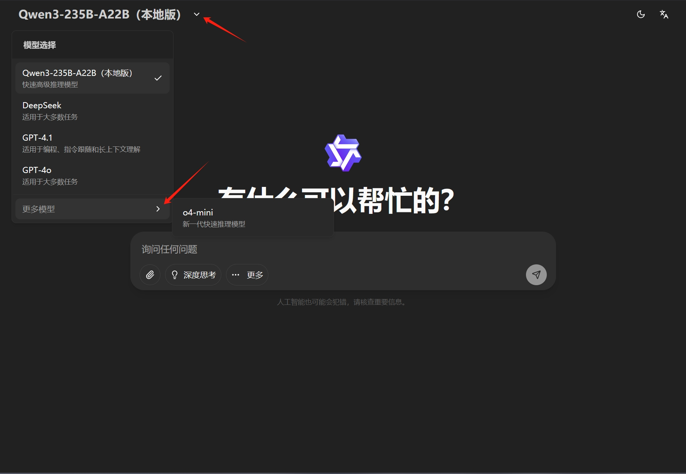
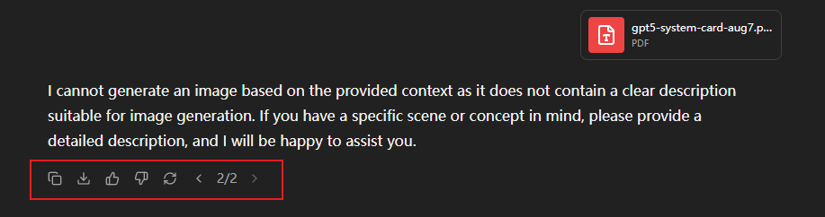
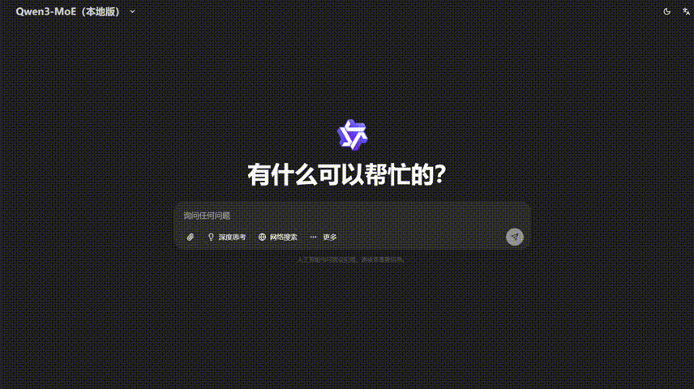
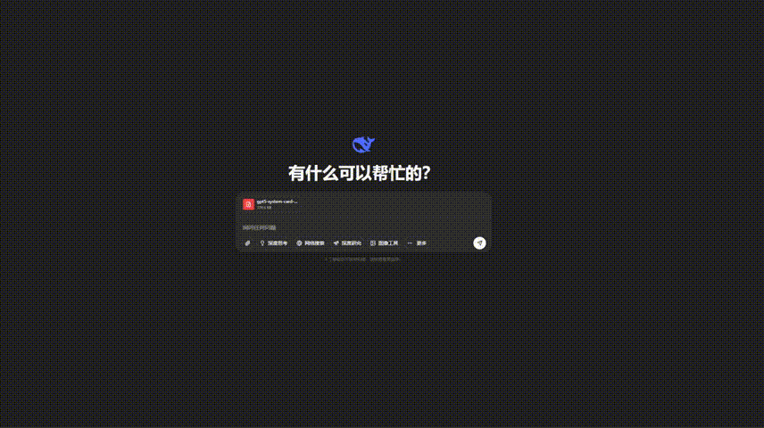

<!-- docs/docs/en/manual/chat.md -->

# **GPT Platform Chat Functionality User Guide**

!!! abstract "Overview"
    This document provides a comprehensive introduction to the chat functionality of the University GPT Service Platform, covering key modules including basic conversations, file uploads, tool usage, model selection, sidebar and history management, and conversation content operations. Through this guide, users can quickly understand the platform's various chat features and their usage methods, enhancing their interaction experience with the GPT platform.

---

## 🎯 Basic Conversation

- Enter the chat interface where you can input questions or requests in the text box, then click the `Send` button at the right end of the text box (or simply press the `Enter` key) to ask your question. After a brief wait, the model will provide a corresponding answer

{ width="700" style="display: block; margin: auto;" }

- During the model's response process, the `Send` button at the right end of the text box changes to a `Stop Response` button. Click it to interrupt the current question's answer

{ width="700" style="display: block; margin: auto;" }

- Below the text box, various currently supported tools are listed for use. Click to display blue highlighting, indicating the tool is enabled. Then input your related question

{ width="700" style="display: block; margin: auto;" }

???+ tip "Tips: Show/Hide Tools"
    - *Click the `More` button to the right of the tools to view hidden tools. Click the tool name again to pin it below the text box*
    { width="700" style="display: block; margin: auto;" }

---

## File Upload

- Button Upload: Click the `File Upload` button at the left end of the text box to upload files

{ width="700" style="display: block; margin: auto;" }

- Drag and Drop Upload: Upload files by `dragging files` to the `chat page`

{ width="700" style="display: block; margin: auto;" }

!!! tip "File Upload Limitations"
    - Maximum of **5** files can be uploaded in a single question
    - Each file has a maximum size of **20MB**
    - Supported file types include:
        - txt, md, json, png, jpg, jpeg, bmp, heic, tiff, pdf, docx, xlsx, xls, pptx, html

---

## 📦 Model Selection

{ width="700" style="display: block; margin: auto;" }

- In the top-left corner of the chat page, you can select a specific model for questions. Click the arrow on the right to see the dropdown menu. Click `More Models` to view all models you currently have permission to use (you can visit `Personal Center` - `Model List` to view introductions of currently available models. For details, see the **Personal Center** page on the left)

- In the same conversation, you can also manually switch models for different questions

---

## 🔧 Sidebar Tools

{ align=right width="300" }

### 1. Sidebar

- The left sidebar primarily displays commonly used conversation modes (regular chat, AIGCD, etc.) and conversation history records, which are grouped and listed chronologically. Below the history records is the Personal Center, where you can view account balance, model information, and more
- Click the button on the top-left to expand/collapse the sidebar. Click the button on the right to open a new conversation page

### 2. History Records

- Click the `···` button at the right end of each history record to rename, pin, or delete the history record

 

!!! tip "Tips: If you leave the history record title blank and press Enter directly, AI will automatically generate a new title through summarization"

---

## 📄 Conversation Operation Management

- Content Copying
    - After the model completes its response, you can easily copy the text or image content of the answer
- Content Export
    - Single Q&A Export: Click the **Export button** in the answer to export that specific Q&A separately
    - Complete Conversation Export: Click the **Export button** in the top-right corner of the page to export the entire conversation history
- Regenerate Answer
    - If you're unsatisfied with the answer, you can click the **Regenerate button** to get a new answer
    - After regenerating the answer, you can click the `<` and `>` buttons below the answer to switch between different answers
- Help Us Improve
    **Strongly recommended** to rate the model's response. Click the :thumbsup: **Like** and :thumbsdown: **Dislike** buttons below the answer to provide feedback. This will help us continuously improve platform quality.

{ width="700" style="display: block; margin: auto;" }

- Edit Sent Questions
    - Click the **Edit button** below the sent question to modify the already sent question
    - After asking again, you can also click the `<` and `>` buttons below the question to switch between different Q&A versions

{ width="700" style="display: block; margin: auto;" }

- Switch Model Conversations
    - For the same conversation, you can switch to appropriate models for Q&A at any time

{ width="700" style="display: block; margin: auto;" }
---

## :material-file-pdf-box: PDF Reading Functionality

- Intelligent PDF Parsing: The platform performs professional intelligent parsing of PDF files. You can open the PDF reading panel by clicking the **`View`** button displayed in the conversation file.

{ width="700" style="display: block; margin: auto;" }

### Main Feature Characteristics

- **:material-text-recognition: Text Extraction**: Automatically parses text content from PDFs
- **:material-image-outline: Image Recognition**: Extracts and recognizes images from PDFs
- **:material-chat-question: Intelligent Q&A**: Provides detailed Q&A for text and images
- **:material-web: Web Search**: Combines web search to provide more comprehensive information

{ width="700" style="display: block; margin: auto;" }

---

## :material-keyboard: Keyboard Shortcuts

Using the following keyboard shortcuts can greatly improve your efficiency:

| Shortcut Combination | Function Description | Usage Scenario |
|---------------------|---------------------|----------------|
| ++ctrl+b++ | Quick toggle sidebar | When you need more display space |
| ++slash++ | Auto-focus to question input box | Quick start to input questions |
| ++shift+enter++ | Line break in input box | When writing multi-line questions |
| ++enter++ | Send message in input box | Complete input and send |
