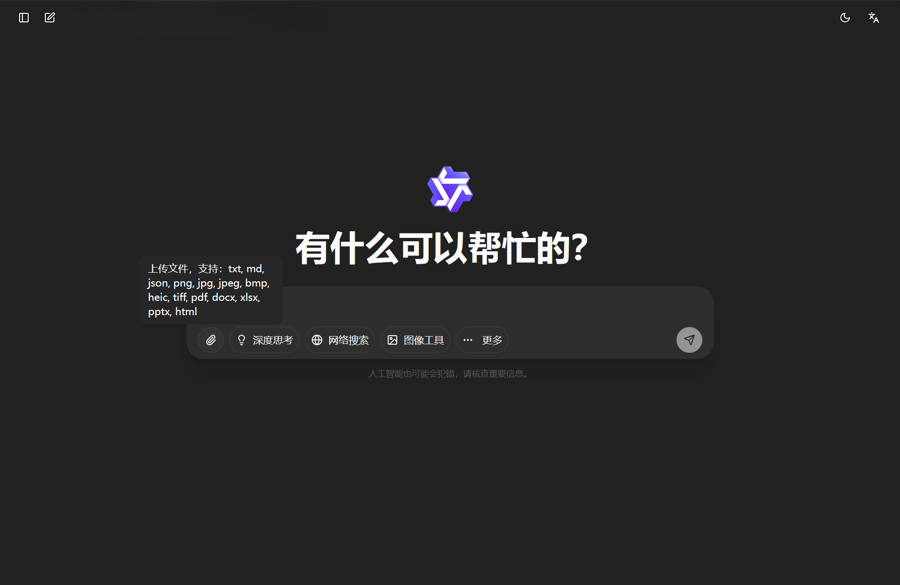
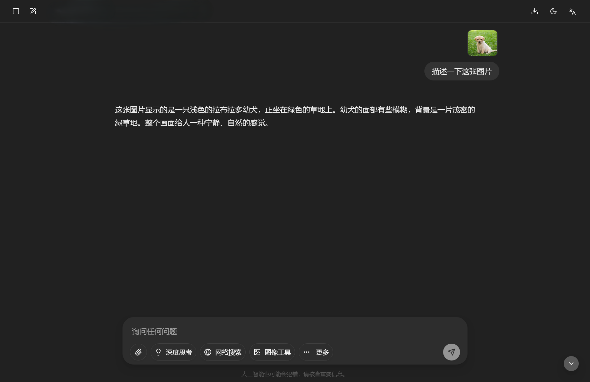
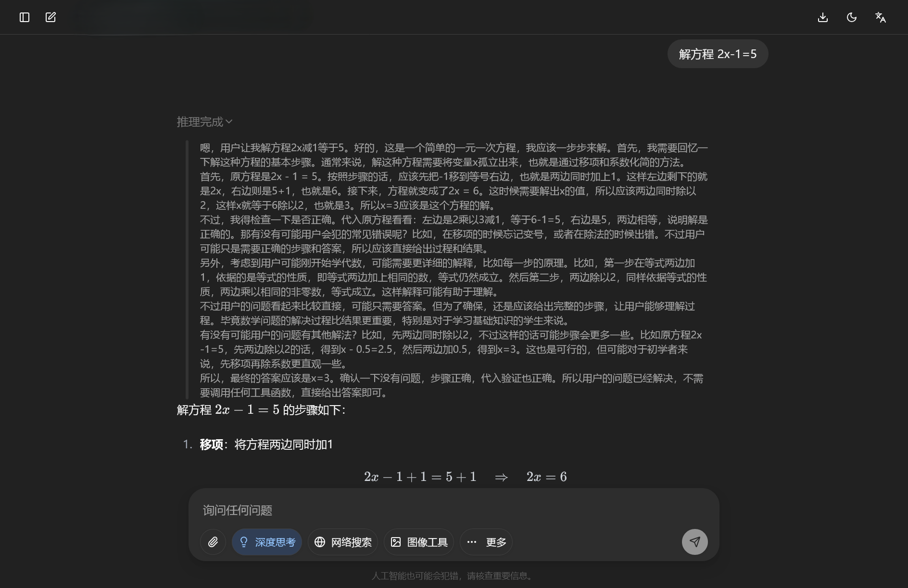
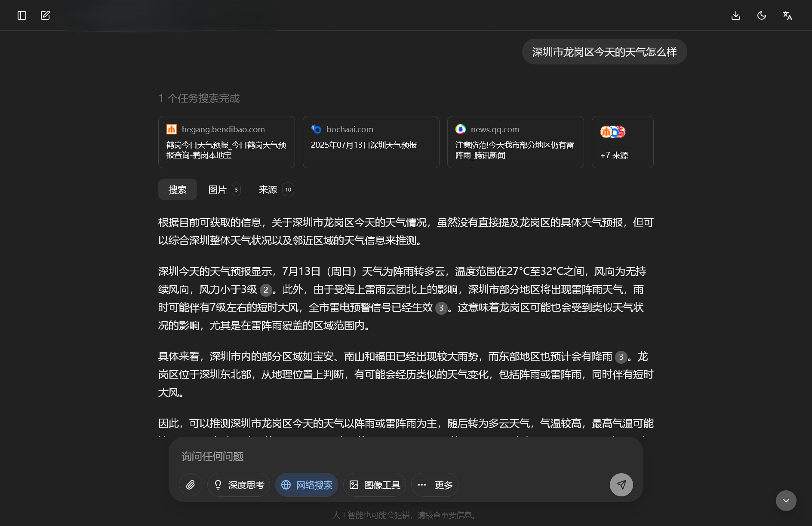
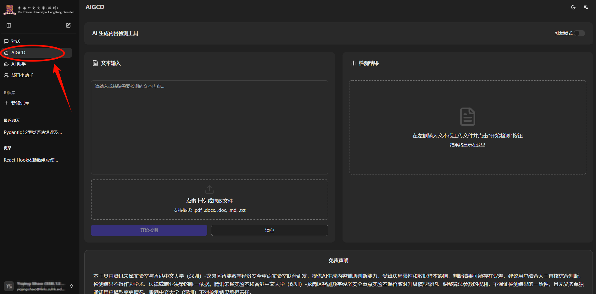
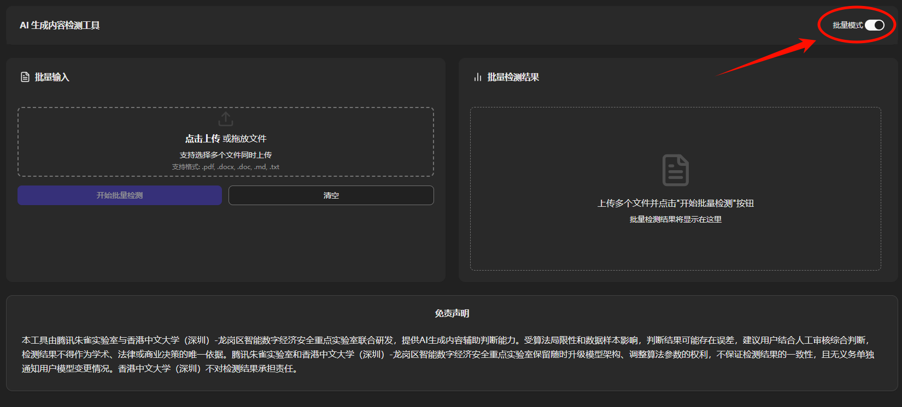

<!-- docs/docs/en/manual/getting-started.md -->

# **User Manual**

!!! abstract "Overview"
    This document serves as a quick start guide for the University GPT Service Platform, systematically introducing the platform's main features and usage methods. The content covers basic functions including platform login, basic conversations, file uploads, deep thinking, web search, image tools, mind mapping, as well as extended features such as AIGCD detection and AI assistant, helping users get started quickly and use the platform efficiently.
---

## 🎯 Introduction to GPT Platform

The GPT platform provides various models and services that can recognize, understand, and generate natural language, code, images, and other content, helping you solve problems, write content, or provide suggestions.

### Login

You can log into the University GPT Service Platform using your student ID (for students) / email prefix (for faculty and staff) and corresponding password

### First Conversation

You can ask questions or make requests in the text box of the chat interface, wait for the model's response, and the input language should be as clear and natural as possible

??? tip "Tips: Stop Response"
    - *Click the button on the far right of the text box during the model's response to stop the answer*
    

!!! info "Usage Limitations"
    Each person has a weekly limit on the number of Tokens they can use. **Balance is reset on the first login of each natural week**. For pricing of each model, please refer to: [Model Information](../models.md).

    You can view your usage and remaining balance in [Account Information](./account.md#_3).

---

## 📦 Basic Features

This section introduces the most fundamental features provided by the GPT platform, meeting the daily usage needs of the vast majority of users

### **File Upload**

Click the upload button on the far left of the text box, select and upload files of supported types, then input prompts and ask the model related questions

### **Deep Thinking**

Click the `Deep Thinking` button to enable this feature (same applies to other features), input related questions in the text box and ask, and you will see the answer accompanied by the thinking process

??? "Tips: Tool Introduction"
    - *Hover the pointer over the button to view the corresponding feature introduction*
    

### **Web Search**

Click the `Web Search` button to enable this feature (same applies to other features), input related questions in the text box and ask. The reference web materials will appear above the answer

### **Image Tools**

Click the `Image Tools` button to enable this feature (same applies to other features), input related questions in the text box and ask

### **Mind Mapping**

Click the `Mind Mapping` button to enable this feature (same applies to other features), input related requirements in the text box

??? "Tips: Hide/Pin Tools"
    - *Click the `More` button, check the tools to pin them below the text box*
    

---

## 🚀 Extended Features

### **AIGCD**

AIGCD is an AI-generated content detection tool. You can upload files or paste text to check what percentage of the content **might** be generated by AI, with detection results displayed on the right

!!! tip "Tips"

    - If you want to detect multiple files simultaneously, you can click the button in the top-right corner to enable `Batch Mode`

    
