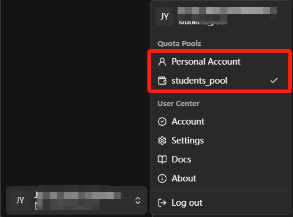
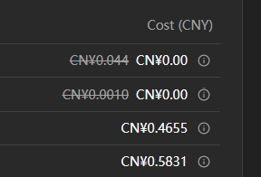

<!-- docs/docs/en/manual/quota.md -->

# Quota Pool

!!! abstract "Overview"
    The Quota Pool is a core resource management feature of the university GPT service platform. Through refined billing control and resource access management, it helps users reasonably plan AI service usage costs and ensures efficient and sustainable service utilization.

## Core Features

The Quota Pool provides two main core functions:

### Billing Management
- **Precise Deduction**: Real-time precise billing based on actual AI models used and token consumption.
- **Balance Control**: Each quota pool has an independent balance limit; exceeding the limit will prevent further usage.
- **Cost Tracking**: Detailed records of each conversation's fee breakdown for cost analysis and budget control.

### Resource Access Control
- **Permission Isolation**: Different quota pools can set different model access permissions and usage restrictions.
- **Flexible Allocation**: Supports allocating different quota pool resources by user, department, or project.
- **Usage Monitoring**: Real-time monitoring of quota usage with timely warnings and adjustments.

## Quota Pool Types

### Personal Account
Personal accounts are quota pools for individual use. Currently, student personal accounts are not available, but full-time staff can use them.

- Weekly fixed quota
- Automatically reset the balance every Friday at 1 AM

### Quota Pool
Currently, full-time staff do not have quota pools, but students can use the ```Students Pool``` quota pool.

- **Groups, colleges, departments, and research teams with team budget requirements for model usage or advanced model needs can contact the Information Technology Services Office.**
- For the ```Students Pool``` quota pool used by students, the balance is automatically restored every Friday at 1 AM.

!!! tip "What to do when quota runs out?"
    If quota runs out, you can:

    1. **Use Free Model**: Switch to Qwen3-MoE (On-Premise), it's free and doesn't consume quota
    2. **Wait for Refresh**: Full-time staff personal accounts and student default pool ```Students Pool``` are automatically restored every Friday at 1 AM. Or other quota pools have corresponding refresh time settings, please ask the relevant quota pool administrator
    3. **Switch to Available Quota Pools**: If there are other available quota pools

## Operation Switching

Users can switch between different quota pools as needed, with each quota pool having independent balance and permission settings.

### Switching Quota Pools
Select the target quota pool to switch in the Account Center or chat interface.



After switching, the system will use the new quota pool's balance for billing and follow that quota pool's permission rules.

!!! tip "Switching Tips"
      - Quota pool switching takes effect immediately and does not affect ongoing conversations.
      - If the target quota pool has insufficient balance, you may not be able to continue using certain functions after switching.
      - It is recommended to select an appropriate quota pool based on usage scenarios to avoid resource waste.

## Billing Logic

### How Billing Works

You can view billing details in your user information. Billing follows the formula: ```Final Cost = Original Cost × Discount Rate```. The crossed-out price shows the original cost, followed by the actual charge. Currently, only chat services have potential discounts.



- **Token-based Billing**: Charged based on the number of tokens used in conversations
- **Different Model Prices**: Advanced models cost more than basic models
- **Real-time Deduction**: Fees are deducted immediately after each conversation, and you can view consumption records in real-time in **Account Center - Account Information**. The records shown are your consumption records across all quota pools

!!! info "Model Pricing"
    You can view [models information](../models.md) for currently supported models and specific pricing.

!!! info "Fee Viewing"
    You can view the current quota pool's usage and remaining quota in [Account Center - Account Information](./account.md#_3).