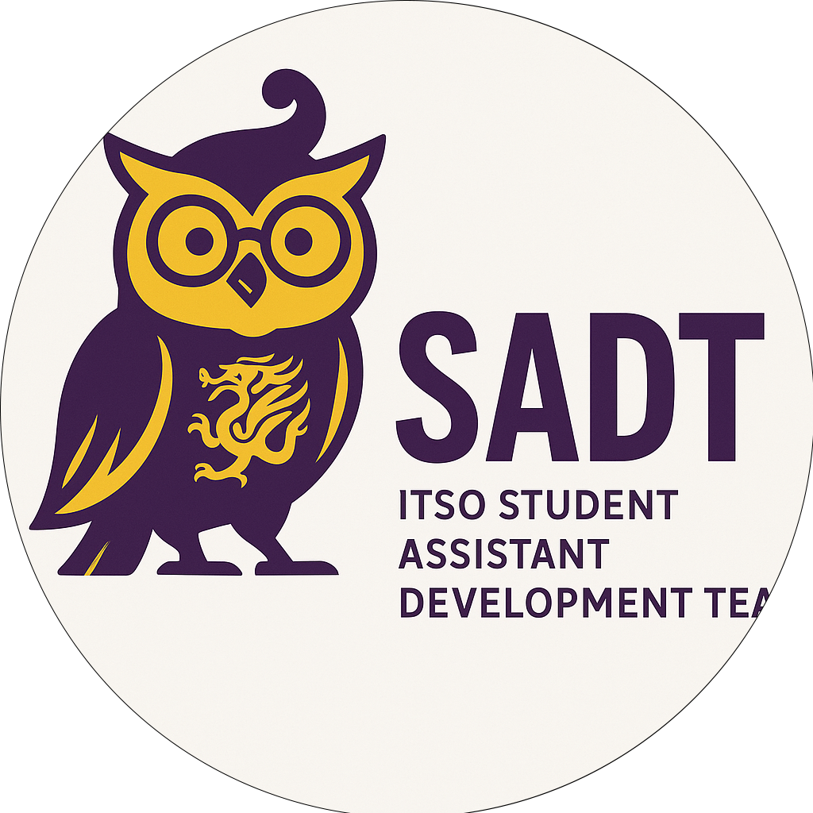

---
hide:
  - navigation
  - toc
  - title
---

    

        
团队介绍与招聘信息

    

    

        

            ITSO 学生助理开发团队
        

    

    

        
    

    

        
💡 真实项目实践

        
🚀 技术成长平台

        
🤝 高效协作氛围

    

    

        

            
3+

            
代表项目

        

        

            
4

            
招聘岗位

        

        

            
25元

            
薪酬/工时

        

    

    

        <h2 style="color:#fff;margin-bottom:16px;font-weight:bold;font-size:26px;">关于我们</h2>
        

            我们是 ITSO（资讯科技服务处）学生助理团队开发小组，专注于信息技术相关软件的设计与开发，致力于为用户提供高效、安全、创新的 IT 服务。
        

        

            <h3 style="color:#fff;font-weight:bold;font-size:26px;">我们的优势</h3>
            <ul style="color:rgba(255,255,255,0.85);font-size:18px;">
                <li>参与真实项目，获得实战经验</li>
                <li>技术成长平台，定期分享与讨论</li>
                <li>高效团队氛围，协作与成长并重</li>
            </ul>
        

        

            <h3 style="color:#fff;font-weight:bold;font-size:26px;">代表项目</h3>
            <ul style="color:rgba(255,255,255,0.85);font-size:18px;">
                <li>大学 GPT 服务平台</li>
                <li>ITSO 学生助理排班打卡系统</li>
                <li>校园网络监测工具</li>
            </ul>
        

    

    

        

            <h3 style="color:#fff;font-weight:bold;">主要工作职责</h3>
            <ul style="color:rgba(255,255,255,0.85);font-size:16px;">
                <li>开发与运维大学 GPT 服务主服务、微服务及配套支持服务</li>
                <li>维护团队过往项目</li>
            </ul>
        

        

            <h3 style="color:#fff;font-weight:bold;">招聘岗位</h3>
            

                

                    
A. 集群运维

                    
B. 后端开发

                    
C. 前端开发

                    
D. 全栈开发

                

            

            

                

                    
A. 集群运维

                    <ul>
                        <li>负责 Kubernetes 集群运维、资源分配、CI/CD 流程等</li>
                        <li>优选：有容器部署与维护、云原生架构设计经历，有团队开发经验</li>
                    </ul>
                

                

                    
B. 后端开发

                    <ul>
                        <li>负责 GPT 服务新功能研发、代码优化、故障诊断</li>
                        <li>优选：熟悉 Python/Go/Java，数据库、算法，有团队开发经验</li>
                    </ul>
                

                

                    
C. 前端开发

                    <ul>
                        <li>负责 GPT 服务前端研发与界面设计优化</li>
                        <li>优选：有 Vue/React 项目经验，了解前后端通信原理</li>
                    </ul>
                

                

                    
D. 全栈开发

                    <ul>
                        <li>统筹设计前后端架构，编写与审核项目代码</li>
                        <li>优选：熟悉 Python、JS/TS、Django、React、有团队开发经验</li>
                    </ul>
                

            

        

        

            欢迎有热情、有想法的你加入我们！
        

    

    

        <h2 style="color:#fff;text-align:center;margin-bottom:16px;font-weight:bold;">薪酬待遇</h2>
        

            按照学生助理薪酬标准，25元/工时，每月上报工时不超过40小时（超过800元部分需缴税20%，次年初可申请退税并全部退还）。
        

    

    

        <h2 style="color:#fff;text-align:center;margin-bottom:16px;font-weight:bold;">联系方式</h2>
        <ul style="color:rgba(255,255,255,0.85);font-size:18px;text-align:center;list-style:none;padding:0;">
            <li>邮箱：gpt@cuhk.edu.cn</li>
            <li>微信公众号：香港中文大学深圳ITSO</li>
            <li>校园办公地点：TD（医学院）一楼 ITSO服务台</li>
        </ul>
    
