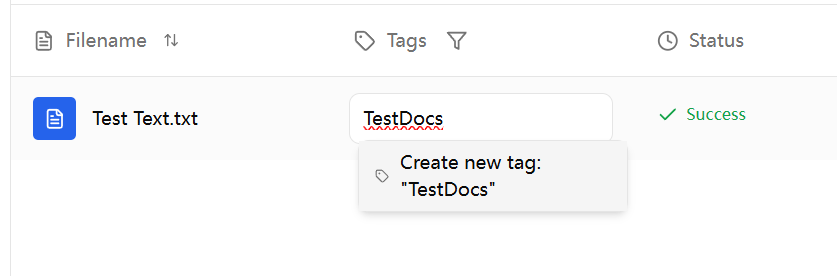
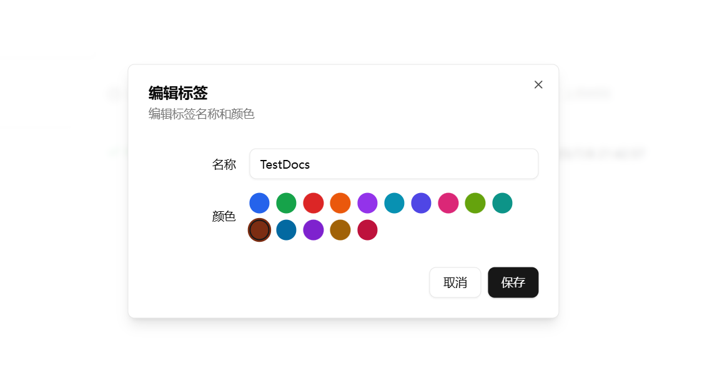

# 技术指南：文档内容与节点优化管理

本文档为语料库内容与节点优化的技术操作指南，详细阐述了文档上传后的系统处理机制、知识节点概念以及节点优化技术方法。通过规范化的节点管理，可有效提升AI问答质量与检索准确性。

---

## 1. 文档内容与节点查看方法

首先，需要进入语料库管理界面的"文档列表"标签页。

在文档列表中，针对每一份文档，最后的操作列都有几个核心功能图标。

### 第一步：查看文档解析内容

点击**眼睛图标** (查看)，您可以预览系统从原始文件中解析出的纯文本内容。

*   **这是AI“看到”的原文**。请务必检查这份内容的准确性。如果这里的文本出现乱码、缺失或格式错乱，那么AI的学习效果必然会大打折扣。这是排查问题的第一站。

### 第二步：进入节点编辑器

点击**网络图标** (编辑节点)，您将进入这份文档的“知识节点编辑器”。这里是进行精细化优化的主战场。

---

## 2. 核心概念：知识节点定义

### 技术概念解析

知识节点是系统对上传文档进行智能处理后形成的结构化数据单元。若将文档视为**完整资料库**，则知识节点相当于AI从中提取的**关键信息片段**或**核心知识点**。

系统通过自动化处理机制，将长文档切分为多个知识节点，以支持AI在问答过程中的高效检索与精准匹配。

### 为什么节点质量至关重要？

当用户提出问题时，AI并不会全文阅读每一份相关文档。它的工作流程是：  

1.  **检索 (Retrieval)**：在海量的知识节点中，快速找到与问题最相关的几个节点。
2.  **生成 (Generation)**：基于这几个节点的内容，结合用户的问题，组织语言并生成最终答案。

因此，如果节点本身的质量不高（比如内容不完整、包含无关信息），那么AI找到的“原材料”就是有瑕疵的，最终生成的答案自然也难以令人满意。

### 什么是一个“好”的节点？

一个高质量的知识节点通常具备以下特点：  

*   **主题聚焦**：一个节点应该只讨论一个相对独立和完整的主题。例如，一个关于“年假政策”的节点，就不应该夹杂“报销流程”的信息。
*   **上下文完整**：节点内容应该是自洽的，即不依赖紧邻的前后文也能被读懂。AI在检索时是独立看待每个节点的。
*   **简洁清晰**：去除口语化、重复或无意义的词句，保留核心信息。

---

## 3. 如何编辑和优化节点？

在节点编辑器中，您可以看到文档被切割成的所有节点列表。

1.  点击任意一个节点，可以展开查看其详细内容。
2.  点击“编辑节点”按钮，即可进入编辑模式。

### 编辑节点文本

在“文本内容”编辑框中，您可以进行以下优化：  

*   **修正错误**：修改OCR识别错误、错别字或格式问题。
*   **增强相关性**：删除与该节点主题无关的句子，或将一个包含多个主题的节点拆分（手动复制内容到其他节点或新创建）。
*   **补充上下文**：如果发现一个节点因为切分导致语义不完整（比如一句话被切成了两半），您可以手动将其补充完整。

> 如果PDF文档中包含网页链接
> AI很有可能因为文档识别有误差，无法正确输出链接，需要手动修正

### 保存您的修改

完成编辑后，点击“保存”按钮。您的修改会立刻生效，并更新到AI的语料库中。下次再有相关提问，AI就会使用您优化过的新节点内容了。

---

## 4. 使用标签进行分类管理

除了优化内容，您还可以为文档打上**标签 (Tag)**，以便于在文档列表中进行分类、筛选和管理。

**核心要点**：  

*   **标签仅用于管理**：标签是一种元数据，其主要作用是帮助您组织和查找文档。它**不会**以任何方式影响AI的检索逻辑或回答内容。
*   **全局统一**：在一个语料库内，所有标签都是全局统一的。当您修改一个标签的名称或颜色时，所有使用了该标签的文档都会同步更新。

### 如何管理标签？

在“文档列表”页面，您可以看到每篇文档的标签栏。  

*   **添加标签**：
    1.  点击标签栏的输入区域。
    2.  直接输入新标签的名称，然后按 `Enter` 键即可创建并添加。
    3.  您也可以输入关键词，从已有的标签列表中选择一个进行添加。

    

*   **移除标签**：
    *   将鼠标悬停在您想移除的标签上，标签右侧会出现一个 `x` 图标，点击即可将其从当前文档中移除。这不会删除标签本身。

    

*   **编辑标签**：
    *   直接点击某个已添加的标签，会弹出一个编辑窗口。
    *   您可以修改标签的**名称**和**颜色**。
    *   请注意，这个修改是**全局性**的。例如，您将 “财务” 标签的颜色从蓝色改为红色，那么语料库里所有带“财务”标签的文档，其标签颜色都会变为红色。

    

### 支持按照标签筛选文档

---

## 5. “编辑节点” vs “重新索引”：如何选择？

在节点编辑器中，还有一个非常强大的功能：“重新索引”。理解它与“编辑节点”的区别至关重要。  

*   **编辑节点 (精修)**  
    *   **何时使用？** 当文档的整体切分效果不错，只有个别节点存在小瑕疵（如错别字、单句不完整）时使用。
    *   **效果**：只修改您编辑的那个节点，不影响其他节点。好比是给书本的某一页贴一张勘误便签。

*   **重新索引 (重做)**  
    *   **何时使用？** 当您发现整篇文档的节点切分效果都很糟糕时。例如，所有节点都过长或过短，或者句子被大量从中间切断。需要调整分块大小，节点块之间的重叠词数。
    *   **效果**：**删除当前文档所有的旧节点**，然后根据您在“高级配置”中设定的新参数（如知识块大小），从原始文件开始，重新执行一遍完整的切分和索引流程。这相当于把一本书重新装订。

> **结论**：先尝试“编辑节点”进行微调。如果发现问题是系统性的、普遍的，再考虑使用“重新索引”从根本上解决问题。

---

## 6. 故障排查：当AI回答不佳时

如果您发现AI的回答不准确、遗漏信息或无中生有，可以遵循以下步骤进行排查和优化：

1.  **检查原文**：首先，通过“查看文档”功能，确认系统解析出的文本内容是否准确无误。如果原文就有问题，需要重新上传一份正确的文档。  
2.  **检查节点**：如果原文无误，进入“节点编辑器”，检查与问题相关的节点。  
    *   AI是否找到了正确的节点？
    *   这些节点的内容是否清晰、完整？
    *   是否存在节点切分不合理，导致关键信息被分割在两个或多个节点中的情况？
3.  **尝试优化**：  
    *   针对有问题的节点，尝试使用“编辑节点”功能进行修正。
    *   如果发现大部分节点都存在切分问题，可以尝试使用“重新索引”功能。在弹出的高级配置中，可以适当**调小“知识块大小 (Chunk Size)”**，让每个节点包含更聚焦的信息，有时能改善效果。  
4.  **测试效果**：完成优化后，回到语料库的“检索测试”页面，用同样的问题再次提问，检验优化效果。

通过以上方法，您将能更深度地掌控语料库的运作，将AI助手的潜力发挥到极致。 