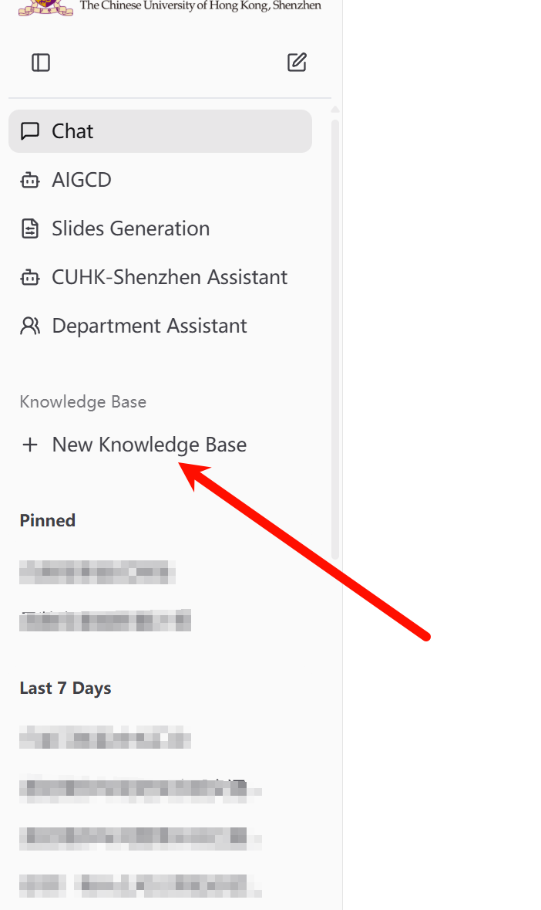
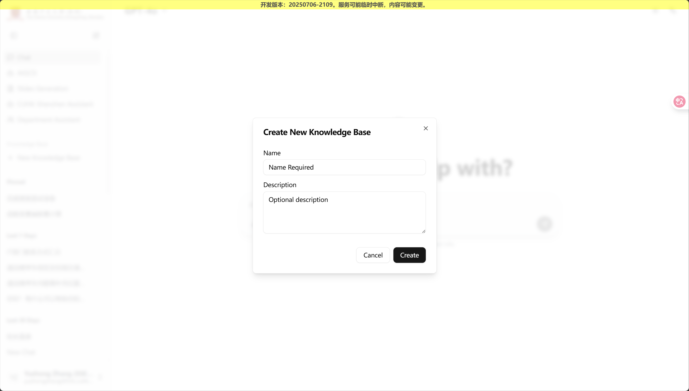
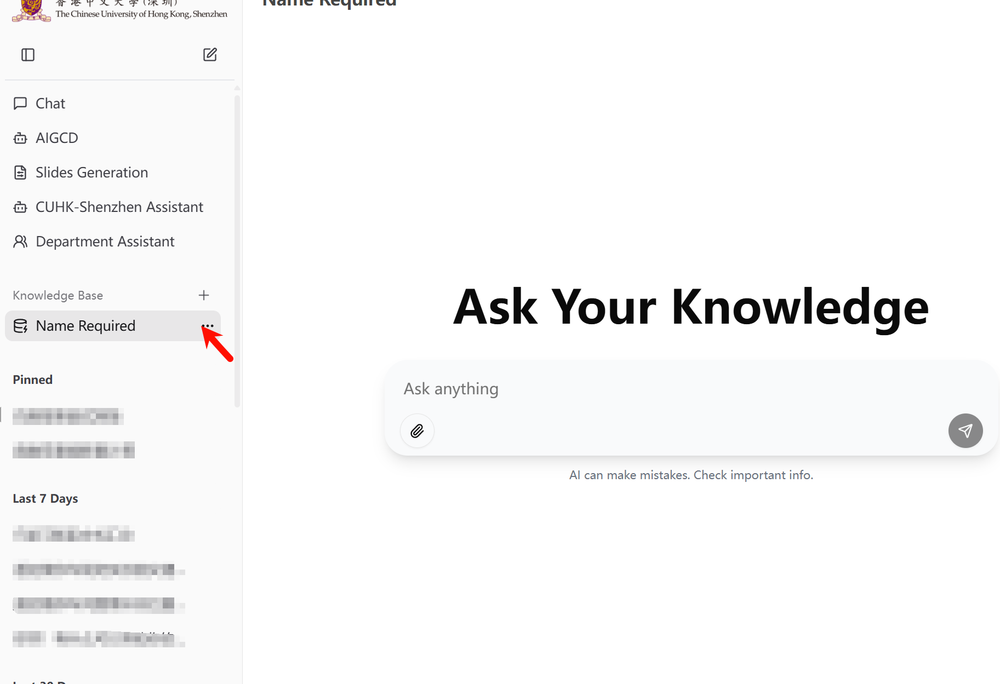
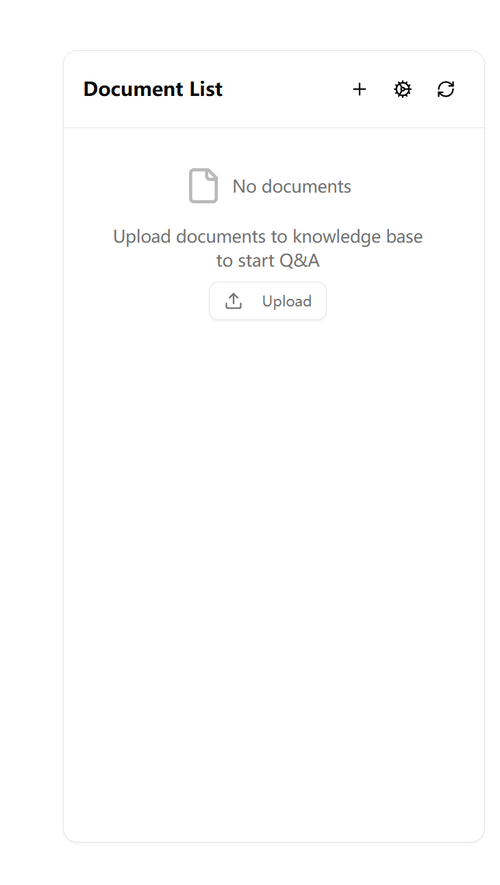
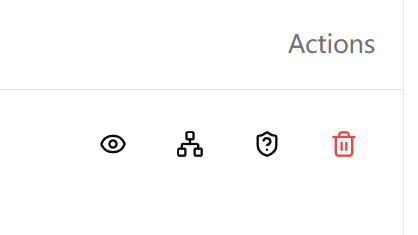

<!-- docs/docs/zh/knowledge/index.md -->
# 语料库管理员操作手册

本手册为语料库管理系统提供标准化操作指南，旨在确保系统管理人员能够规范、高效地执行语料库管理职责。

## 手册适用范围

本操作手册适用于具备语料库管理权限的系统用户，包括以下角色：

- **语料库所有者 (Owner)**：承担语料库创建与管理职责的核心用户
- **语料库管理员 (Admin)**：经授权负责特定语料库管理事务的用户  
- **部门知识管理者**：负责部门级知识库维护与管理的专职人员
- **全站语料库管理员**：具备系统级语料库管理权限的高级管理人员

## 系统访问说明

系统功能访问受权限控制，如遇无法访问相关功能页面的情况，通常基于以下原因：

- **权限限制**：语料库功能目前仅对各部门语料库管理员开放
- **权限要求**：完整功能访问需具备相应级别的语料库管理权限

本手册旨在为语料库系统的规范化操作提供完整指导，协助管理人员掌握部门知识库与企业规章制度的标准管理方法，为各类应用场景建立标准化的操作流程。

---

---

## 1. 语料库概述

语料库作为系统核心的智能文档管理单元，支持用户将各类文档纳入统一管理。系统通过自动化文档处理机制，结合AI对话功能，提供基于文档内容的智能问答服务。

### 语料库创建规范

1.  在左侧导航栏点击"创建语料库"按钮。
2.  输入规范的**名称**（如"ITSO常见问题语料库"）和**简介**（可选）。
3.  点击确认完成创建。创建后，用户将自动成为该语料库的**所有者**。

> **说明**：如需修改语料库名称或简介，可返回语料库列表，点击卡片上的"更多"(...)按钮进行编辑。

### 系统界面架构

语料库系统提供两大核心功能界面：**问答界面**用于日常交互操作，**管理界面**用于深度配置管理。

#### 问答界面功能
创建语料库后，系统将自动进入**问答界面**。该界面用于与语料库进行实时交互。用户上传文档后，可在此界面进行问答操作。

界面右侧提供**文件列表**功能，展示已成功处理的文档，便于用户快速查看和管理。

#### 管理界面访问
如需对语料库进行详细配置，请点击文件列表上方的**齿轮图标**，进入管理界面。

---

## 内容管理

### 文档管理规范

语料库的核心价值在于其内容管理能力。用户可在**问答界面**直接上传文档，或在**管理界面**的"上传文档"标签页中进行操作。

#### 支持的文件格式
系统支持多种文件格式的文档处理：  

- **文档类**：`.pdf`, `.docx`, `.txt`, `.md`, `.html`  
- **表格类**：`.xlsx`  
- **演示文稿类**：`.pptx`  
- **图像类**：`.png`, `.jpg`, `.jpeg`, `.bmp`, `.heic`, `.tiff` (支持文字识别)  
- **数据类**：`.json`  

#### 文档处理状态说明
上传后，系统将为每个文件显示相应的处理状态：  

- **处理中**：系统正在进行文档内容的学习与分析。  
- **成功**：文档已成功完成处理并纳入检索库，可用于智能问答。  
- **失败**：文档处理过程中遇到异常。用户可进入管理界面的"文档列表"，定位该文件并执行"重新索引"操作。  

### 管理仪表盘概览

进入管理界面后，您会看到几个核心功能标签页：  

- **文档列表**：这里展示了您上传到库中的所有文档及其详细状态。  
- **权限管理**：在这里，您可以精细地控制谁可以访问您的语料库，以及他们能做什么。  
- **检索测试**：在这里可以针对不同检索参数测试语料库问答效果。  
- **上传文档**：在这里可以上传新的文档。  
- **语料库设置**：在这里，您可以修改语料库的基本信息、AI回答的风格和检索方式等高级配置。  

### 文档列表详解：查看、编辑与授权
在“文档列表”标签页中，您可以看到所有已上传文档的详细信息。对于每一篇文档，您都可以执行以下核心操作：  

从左至右，三个操作按钮的功能依次是：

#### 1. 查看文档

点击后可详细查看文档的元数据和解析后的内容。这也是AI用来学习和检索的数据原文。  

- **内容准确性**：如果发现解析内容有误，可能会影响AI的理解和回答质量。  
- **下载原文**：点击弹窗下方的“下载”按钮，可以直接获取您上传的原始文件。  

#### 2. 编辑节点与重新索引

这里是语料库检索的核心。为了实现智能检索，系统会自动将每篇文档切分成若干个**“知识节点”**。AI在回答问题时，会先找到最相关的节点，然后基于这些节点的内容生成答案。  
- **重新索引**：如果文档处理失败或内容有更新，您可以在此界面点击“重新索引”按钮，让系统重新学习这份文档。  

#### 3. 文档权限管理

这里可以针对**单篇文档**设置独立的访问权限。详细的权限管理策略将在下一章节介绍。

---

## 3. 权限系统：谁能看，谁能改

这是语料库最核心的功能之一。通过灵活的权限配置，您可以确保正确的人在正确的场景下访问正确的信息。

### 理解文档的四种权限等级

从高到低，权限分为四个等级。高等级自动包含所有低等级的能力。

| 权限等级 | 核心能力 | 通俗解释 |
| :--- | :--- | :--- |
| **Admin (管理员)** | 对文档进行授权管理 | **经理** 可以管理文档、配置，最重要的是可以管理用户权限。 |
| **Read-Write (读写)** | 上传/修改文档和标签 | **贡献者/编辑** 可以往语料库里添加和修改内容。 |
| **Read (只读)** | 查看和下载文档原文 | **访客** 可以浏览语料库里的所有文档，像逛图书馆一样。 |
| **Retrieve (仅检索)**| **无法查看文档列表**，但能通过AI助手搜索到内容 | **提问者** 他甚至不知道这个语料库的存在，但在全局搜索时，如果内容相关，AI会从这里找答案给他。 |

> 权限大小关系：
> Admin（管理员） > Read-Write（读写） > Read（只读） > Retrieve（仅检索）

**关键区别**：“只读”权限的用户能看到语料库和其中的所有文件，而“仅检索”权限的用户看不到，但其内容可以被AI助手“隔空”调用以回答问题。

### 如何进行授权

在语料库的“权限管理”标签页中，您可以将权限授予不同的人或群体：  

1.  **授权给个人**：直接输入对方的IT账号（UPN/邮箱），授予特定权限。适合个人授权场景。
2.  **授权给部门**：选择一个部门（如“财务部”），该部门的所有成员将自动获得相应权限。适合部门内部知识共享。
3.  **授权给特定身份**：选择一种身份（如“所有学生”、“所有教职工”），进行批量授权。
4.  **授权给复合规则（高级）**：您可以创建非常精确的规则，例如授权给“深圳校区所有在校的本科生”。这是一个强大的工具，用于实现复杂的权限控制。

### 核心功能：权限继承

在“语料库设置”中，有一个**“权限继承”**的开关，默认为开启。

- **继承开启（推荐）**：这是“一劳永逸”模式。您在语料库层面设置的权限，会自动应用到库内的**每一篇**文档上。管理起来非常简单。  
- **继承关闭**：这是“精细控制”模式。关闭后，您可以为语料库中的**某一篇特定文档**设置与整个库完全不同的权限。例如，整个语料库对部门开放，但其中一份机密文件只对几个人开放。

---

## 4. （全站管理员）审批中心

为了系统安全，当普通语料库所有者（非全站管理员）尝试进行大规模授权（例如，授权给整个部门或所有学生）时，该操作不会立即生效，而是会创建一个**审批请求**。

**全站语料库管理员**：
1.  在管理后台看到这些待审批的请求。
2.  仔细审查请求的合理性。
3.  选择**“通过”**或**“拒绝”**。审批通过后，权限才会正式生效。
4.  对于已经批准的权限，如果后续发现问题，您也可以随时**“撤销”**。

---

## 5. 常见问题 (FAQ)

*   **问：作为全站管理员，为什么在左侧边栏看不到系统里所有的语料库？**
    *   **答：** 这是为了避免您的侧边栏被成百上千个语料库淹没，给您带来不必要的干扰。您的侧边栏只会像普通用户一样，展示您是所有者或被明确授予了访问权限的语料库。您可以在“语料库管理”主页搜索并管理任何一个语料库。

*   **问：“只读(Read)”和“仅检索(Retrieve)”权限到底有什么区别？**
    *   **答：** 一个很好的类比是图书馆。
        *   **只读**权限就像是给了您一张阅览证，您可以走进图书馆，随意浏览书架上的每一本书。
        *   **仅检索**权限就像是您去问图书管理员一个问题。管理员会根据他读过的所有书，给您一个精准的答案，但您自己不能进入书库翻阅那些书。这个权限对于让全局的“校园助手”能够博采众长非常关键。