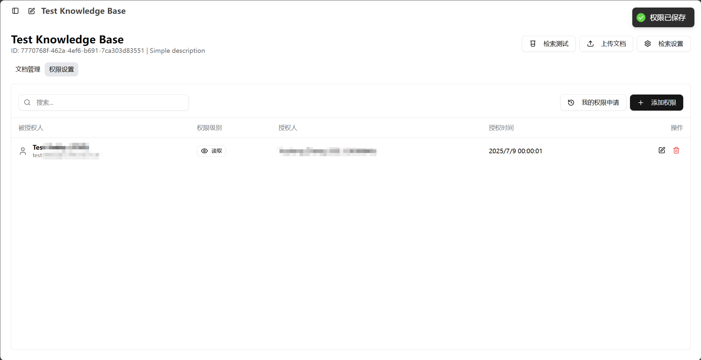

<!-- docs/docs/zh/knowledge/permission-guide.md -->
# 语料库权限管理指南

本文档为语料库权限系统的标准化操作指南，旨在帮助系统管理员深入理解并规范运用语料库的精细化权限控制机制，确保知识资产在高效共享的同时，达到企业级的安全防护标准。

---

## 1. 权限体系架构：语料库与文档的层级模型

为实现精细化的访问控制，系统针对**语料库 (Namespace)** 和**单篇文档 (Document)** 构建了关联且独立的权限层级结构。深入理解此架构是实施有效权限管理的基础前提。

### A. 语料库的五级权限

语料库作为顶层容器，拥有五个权限等级。高等级自动包含所有低等级的能力。

| 权限等级 | 核心能力 | 通俗解释 |
| :--- | :--- | :--- |
| **Owner (所有者)** | 拥有资源的完全控制权，**可转让语料库，是唯一能指定 `Admin` 的角色** | **创始人/物主** 拥有语料库的最高、绝对权限。每个语料库只有一个Owner。 |
| **Admin (管理员)** | 授权管理、修改配置、删除资源 | **经理** 可以管理语料库的日常运营，包括管理内容和用户权限，但不能转让语料库。 |
| **Read-Write (读写)** | 上传/修改文档内容、管理标签 | **贡献者/编辑** 可以往语料库里添加和修改内容。 |
| **Read (只读)** | 查看和下载文档原文、在语料库内检索 | **访客** 可以浏览语料库里的所有文档，像逛图书馆一样。 |
| **Retrieve (仅检索)**| **无法查看文档列表**，但能通过AI助手搜索到内容 | **提问者**。他不知道这个语料库的存在，但在全局搜索时，AI会从这里找答案。 |

> 权限层级关系:
> `Owner` > `Admin` > `Read-Write` > `Read` > `Retrieve`

### B. 单篇文档的四级权限

对于语料库中的每一篇独立文档，可以设置四个权限等级。

| 权限等级 | 核心能力 |
| :--- | :--- |
| **Admin (管理员)** | 对这篇文档进行独立的授权管理。 |
| **Read-Write (读写)** | 修改这篇文档的节点/标签、重新索引。 |
| **Read (只读)** | 查看这篇文档的全文、节点、下载原文。 |
| **Retrieve (仅检索)**| 内容可被AI助手检索到。 |

**关键区别**：单篇文档**没有 `Owner` (所有者)** 的概念。`Admin` 是可以在单篇文档上授予的最高权限。文档的最终权限，取决于**语料库是否开启了权限继承**，我们将在第五节详细说明。

**关键区别：“只读” vs “仅检索”**  
这是权限系统中最需要理解的一个区别：  

*   **只读 (Read)** 权限就像是给了某人一张阅览证，他可以走进这个语料库“图书馆”，随意浏览书架上的每一本书。
*   **仅检索 (Retrieve)** 权限则更像是他去咨询图书管理员。管理员会根据他博览群书的知识给出一个精准答案，但提问者自己不能进入书库翻阅那些书。这个权限对于让全局的“校园助手”能够博采众长、汇集全校知识而又不泄露文档本身，至关重要。

---

## 2. 权限细则：不同等级能做什么？

为了让您更清晰地了解每个权限等级的具体能力，我们将操作分为“语料库层面”和“文档层面”进行详细说明。

### A. 语料库层面的操作权限

*   **`Owner` (所有者) 可以**:  
    *   执行以下所有 `Admin` 的操作。
    *   任命或移除语料库的 `Admin`。
    *   将语料库的所有权转让给其他用户。
*   **`Admin` (管理员) 可以**:
    *   执行以下所有 `Read-Write` 的操作。
    *   修改语料库的名称、描述、权限继承模式及检索配置。
    *   向其他用户授予语料库的 `Read-Write`, `Read`, `Retrieve` 权限。
    *   删除整个语料库。
*   **`Read-Write` (读写) 可以**:
    *   执行以下所有 `Read` 的操作。
    *   在语料库中上传新文档。
    *   重新索引整个语料库。
*   **`Read` (只读) 可以**:
    *   执行以下所有 `Retrieve` 的操作。
    *   在左侧边栏看到此语料库。
    *   在语料库的“检索测试”功能中进行测试。
    *   查看和下载语料库内所有（您有权限查看的）文档。
*   **`Retrieve` (仅检索) 可以**:
    *   让全局的AI助手在回答问题时，能够检索到此语料库中的内容。

### B. 文档层面的操作权限
这些是针对语料库中单篇文档进行操作的权限。请注意，这些操作能否执行，还取决于语料库是否关闭了“权限继承”。  

*   **对文档拥有 `Admin` 权限，可以**:
    *   执行以下所有 `Read-Write` 的操作。
    *   对这篇独立的文档进行授权或取消授权。
*   **对文档拥有 `Read-Write` 权限，可以**:
    *   执行以下所有 `Read` 的操作。
    *   修改这篇文档的内容节点和标签。
    *   重新索引这篇文档。
*   **对文档拥有 `Read` 权限，可以**:
    *   执行以下所有 `Retrieve` 的操作。
    *   查看和下载这篇文档的原文。
    *   查看文档解析后的内容节点和标签。
*   **对文档拥有 `Retrieve` 权限，可以**:
    *   让全局的AI助手在回答问题时，能够检索到这篇文档的内容。

---

## 3. 权限的默认行为与叠加规则

为确保权限系统的行为符合直觉，系统遵循以下两条简单而重要的基本原则：

### A. 所见即所得 (WYSIWYG)

系统的权限是显式的。您为用户或用户组授予了什么权限，他们就拥有什么能力，不多也不少。不存在隐藏的或隐式的权限规则。

### B. 权限叠加时，取最高等级

在实际场景中，一个用户可能会通过多种途径被授予同一个资源的权限。例如，用户既是“IT部”成员（被授予了`只读`权限），又被个人单独授予了`读写`权限。

**在这种情况下，系统将永远采用用户所拥有的最高权限等级。**  

*   **示例**:  
    *   语料库 “IT运维手册” 对 “IT部” 整体授予了 **`Read (只读)`** 权限。
    *   该语料库又对用户 “张三” (他是IT部成员) 单独授予了 **`Read-Write (读写)`** 权限。
    *   **最终结果**: 张三对 “IT运维手册” 拥有 **`Read-Write (读写)`** 权限，因为这是他被授予的最高权限。

---

## 4. 授权方式：如何将权限授予他人

系统提供了强大而灵活的授权机制，您可以将权限授予不同类型的对象。

1.  **授权给个人 (`USER`)**
    *   **方式**：直接输入对方的IT账号（UPN/邮箱）。
    *   **适用场景**：为特定人员开启权限，如项目合作者、临时的内容审核员。

2.  **授权给部门 (`DEPARTMENT`)**
    *   **方式**：从列表中选择一个部门，如“财务部”、“IT服务处”。
    *   **适用场景**：部门内部的知识共享，所有部门成员将自动获得相应权限。

3.  **授权给特定身份 (`IDENTITY_TYPE`)**
    *   **方式**：选择一种预定义的身份类型，如“所有学生”、“所有教职工”。
    *   **适用场景**：面向大规模、具有共同身份特征的群体进行内容发布。

4.  **授权给标签 (`TAG`)**
    *   **方式**: 基于IT-Tools中为用户设定的标签进行授权。
    *   **适用场景**: 适用于需要跨部门、跨身份的灵活分组，例如“核心项目组成员”、“深圳校区新生辅导员”等。

5.  **授权给复合规则 (`ITTOOLS_RULE`) - (高级功能)**
    *   **方式**：这是最强大的授权方式。您可以自定义一组“与/或”规则，对用户的多个属性（如部门、校区、学生类别、职级等）进行组合判断，实现极其精确的权限控制。
    *   **示例**：创建一个规则，授权给“所有在校的、深圳校区的、计算机学院的本科生”。
    *   **影响预估**：对于规则类授权，您还可以预估该规则会影响到大约多少用户，以避免错误的授权范围。

---

## 5. 核心机制：权限继承（开启 vs 关闭）

“权限继承”是语料库权限管理的核心开关，它决定了语料库与其内部文档之间的权限关系。您可以在“语料库设置”中找到并更改它。

| 对比维度 | ✅ **继承开启 (默认模式)** | ❌ **继承关闭 (独立模式)** |
| :--- | :--- | :--- |
| **管理模式** | **统一管理，一劳永逸** | **精细控制，逐个配置** |
| **权限关系** | 文档权限**始终**与语料库保持一致。 | 语料库与文档的权限**完全解耦**。 |
| **如何操作** | 只需在语料库层面授予权限。 | 可以在语料库和每篇文档上分别授予权限。 |
| **对新文档的影响** | 新上传的文档自动获得语料库的**当前**权限。 | 新文档**初始会复制**一份语料库的当前权限，但之后可**独立修改**。 |
| **适用场景**| **绝大多数情况**。适合部门、项目等权限统一的语料库。 | 语料库中包含**少数高度敏感**的文档，需要更严格的独立控制。 |

### ✅ 继承开启模式（推荐）
这是最常用、最简单的管理方式。  

*   **行为**: 您在语料库层面做的任何权限变更——比如给“市场部”授予“只读”权限——都会立刻**自动同步**到该语料库下的**所有文档**上。
*   **示例**: 您将语料库A授权给张三“只读”，那么张三就能读取语料库A里的所有文档。如果您后续撤销了张三的权限，他会同时失去所有文档的访问权。

### ❌ 继承关闭模式
当您需要对个别文档进行特殊权限设置时，应使用此模式。  

*   **行为**: 关闭继承后，语料库的权限和文档的权限就成了两条平行线。您可以独立管理每篇文档的权限，而不会受到语料库权限设置的影响。
*   **示例**:
    1.  语料库B对整个“IT部”授予了“读写”权限。
    2.  您关闭了语料库B的权限继承。
    3.  现在，您可以：
        *   将文档 `B-1.docx` 的权限单独授予给李四“只读”，即使李四不在IT部。
        *   将文档 `B-2.pdf` （一份敏感报告）的权限设置为只有王五（`Admin`）可以访问，IT部的其他人都看不到。
*   **关于新文档**: 在此模式下，当您上传一份新文档时，系统为了方便起见，会先将语料库的权限**复制**一份给新文档。但此后，这份文档的权限就独立了，您可以随时修改，它不会再跟随语料库的权限变化而变化。

> **最佳实践**: 除非您有非常明确的、需要对个别文档进行精细化权限控制的场景，否则**强烈建议您始终保持“权限继承”为开启状态**。这会让您的权限管理工作轻松得多。

---

## 6. 审批流程：大规模授权的安全阀

为防止大规模的权限误用，系统为部分高风险授权操作设置了安全审批流程。作为语料库管理员，当您进行此类操作时，需要提交申请并等待审批。

*   **什么操作需要我提交审批？**  
    1.  **请求基于规则的授权**：任何尝试将权限授予给“部门”、“身份类型”、“标签”或“复合规则”的操作。
    2.  **请求超出授权限额**：当您对单个语料库添加的“个人授权”数量超过系统上限（默认为**20**个）时。

*   **提交审批的限制**
    *   为了防止滥用，每位用户最多只能有 **10** 个处于“待审批”状态的申请。达到此上限后，您需要等待现有申请被处理后才能提交新的申请。

*   **审批流程是怎样的？**
    1.  当您提交需要审批的授权后，该权限**不会立即生效**，而是会生成一条“待审批”的申请记录。
    2.  您的申请将由**系统的全站管理员**进行审核。
    3.  审批通过后，权限才会正式生效；如果被拒绝，则权限不会生效。

*   **如何跟踪我的申请？**
    *   您可以在语料库的“权限管理”页面点击 **“我的申请”** 按钮。
    *   在弹出的窗口中，您可以查看您提交的所有申请记录及其当前的审批状态（待审批、已通过、已拒绝）。

---

## 7. 语料库所有者与管理员 (`Owner` & `Admin`)

作为语料库的管理者，`Owner` 和 `Admin` 是两个最核心的角色。

*   **`Owner` (所有者)** 是语料库的创建者或被转让者。他是语料库的最高控制者，拥有独一无二的权限，例如任命 `Admin` 或将语料库所有权转让给他人。每个语料库只能有一位 `Owner`。

*   **`Admin` (管理员)** 由 `Owner` 指定，是语料库的日常运营官。他们拥有除 `Owner` 专属权限外的所有管理能力，例如配置语料库、管理内容和授予 `Read-Write` 及以下的权限。一个语料库可以有多位 `Admin`。

---

## 8. 操作实战：一步步授予权限

1.  进入您管理的语料库，点击右上角的齿轮图标，进入**管理界面**。  
  
2.  切换到**“权限管理”**标签页。  
3.  点击**“添加规则”**按钮，打开授权弹窗。  
  
4.  在弹窗中，依次选择：  

    *   **授权类型**：是授予给个人、部门还是其他类型。
    *   **授权对象**：输入用户名或选择相应的部门/身份。
    *   **权限级别**：选择 `Admin`, `Read-Write`, `Read` 或 `Retrieve`。
5.  点击**“保存”**。如果您的操作需要审批，系统会提示您请求已提交。
6.  授权成功后，新的规则会出现在列表中。您可以随时点击规则右侧的**编辑**或**删除**图标来修改或撤销该条权限。
