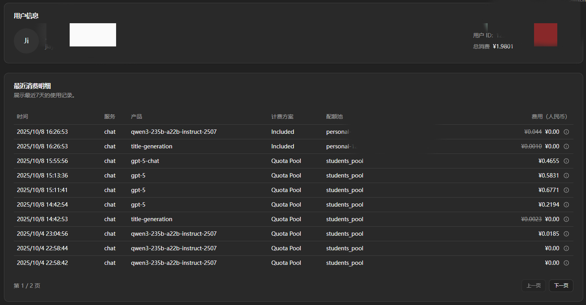
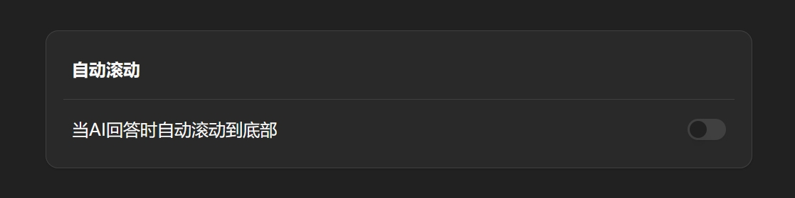
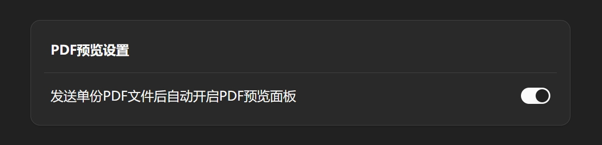
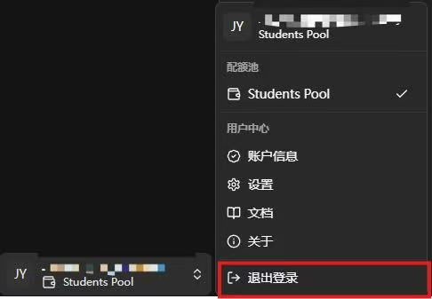

<!-- docs/docs/zh/manual/account.md -->

# **个人中心指南**

!!! abstract "概述"
    本页面汇总并详细介绍了大学GPT服务平台当前支持的主流大模型，包括各模型的供应商、部署方式、主要特性、适用场景、响应速度及使用成本等信息。通过本页面，用户可以快速了解不同模型的优势和适用范围，结合自身需求选择最合适的模型进行使用。
---

## :material-source-commit-start: 开始

- 点击历史记录栏下方用户名即可打开个人中心菜单，点击相应功能进入详情页面

---

## :material-wallet-plus: 账户信息

- 该页面包括当前用户的个人信息、Token余额和Token使用情况。下方的柱形统计图直观地展示近7天内Token的详细使用情况

---

## :material-wrench: 设置

- 点击进入 `设置` 页面可查看GPT平台的基本设置

### 1. 显示设置

- 此处可切换平台的颜色主题（或使用页面右上角 :material-weather-sunny: / :material-weather-night: 按钮快捷切换）

### 2. 自动滚动

- 您可以开关此选项来设置模型回答时页面是否自动滚动到底部

### 3. 工具栏记忆

- 该项用于设置您切换不同对话页时是否保留上一对话中使用的工具调用和问题

### 4. PDF预览设置

- 若打开此选项，则发送单份PDF文件后自动开启PDF预览面板

## :material-alert-box-outline: 关于

- 您可以在当前页面查看大学GPT服务平台开发团队（暨ITSO学生助理开发团队）的相关信息

## :material-exit-to-app: 退出登录

- 点击 `退出登录` 即可登出当前用户

