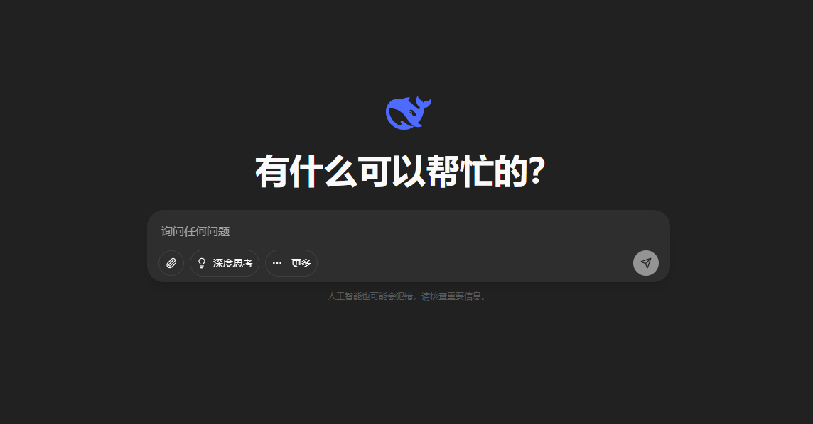
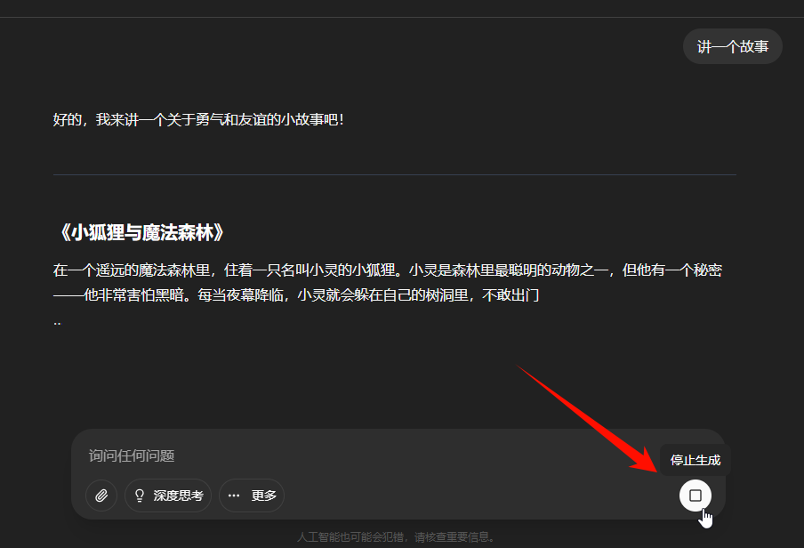
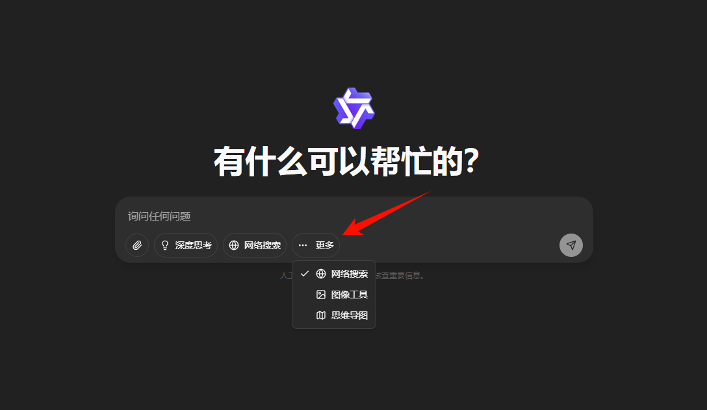
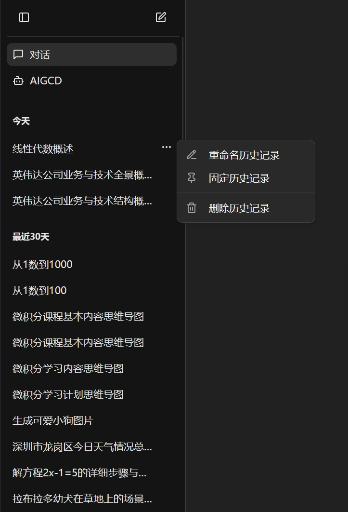
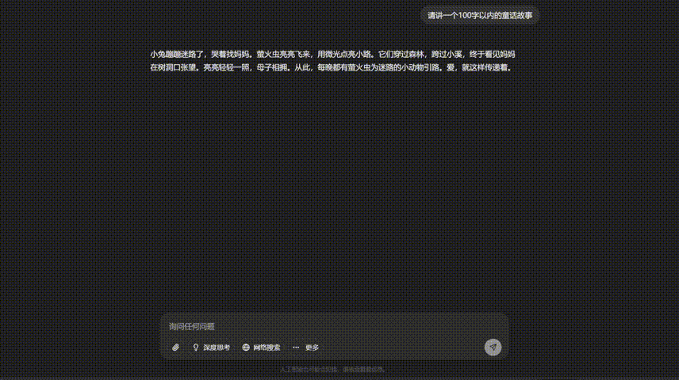
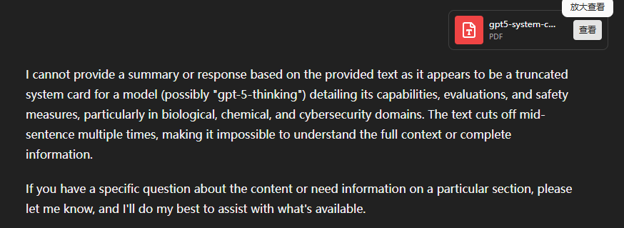

<!-- docs/docs/zh/manual/chat.md -->

# **GPT平台对话功能使用指南**

!!! abstract "概述"
    本文档系统介绍了大学GPT服务平台的对话功能，涵盖了简单对话、文件上传、工具使用、模型选择、侧边栏与历史记录管理、对话内容操作等主要模块。通过本指南，用户可以快速了解平台的各项对话功能及其使用方法，提升与GPT平台的交互体验。

---

## 🎯 简单对话

- 进入对话界面，您可以在文本框中输入问题或请求，然后点击文本框右端的 `发送` 按键（或直接按下 `Enter` 键）即可进行提问，稍等片刻后模型会给出相应回答

{ width="700" style="display: block; margin: auto;" }

- 模型回答过程中，文本框右端的 `发送` 按钮变为 `终止回答` 按钮，点击即可中断当前提问的回答

{ width="700" style="display: block; margin: auto;" }

- 文本框下方列出了当前支持的各种工具供使用，点击后显示蓝色高亮即为开启该工具，再输入相关问题即可

{ width="700" style="display: block; margin: auto;" }

???+ tip "Tips: 显示/隐藏工具"
    - *点击工具右侧 `更多` 按钮可查看被隐藏的工具，再次点击工具名称即可使其固定在文本框下方*
    { width="700" style="display: block; margin: auto;" }

---

## 文件上传

- 按钮上传：点击文本框左端 `文件上传` 按钮上传文件

{ width="700" style="display: block; margin: auto;" }

- 拖拽上传：通过 `拖拽文件` 至 `对话页面` 上传文件

{ width="700" style="display: block; margin: auto;" }

!!! tip "文件上传限制"
    - 单次提问中，文件上传数量上限为 **5** 个
    - 每个文件最大为 **20MB**
    - 支持的文件类型如下
        - txt, md, json, png, jpg, jpeg, bmp, heic, tiff, pdf, docx, xlsx, xls, pptx, html

---

## 📦 模型选择

{ width="700" style="display: block; margin: auto;" }

- 对话页面左上角可选择特定模型提问，点击右侧箭头即可看到下拉菜单，点击`更多模型`可查看当前有使用权限的所有模型（可前往 `个人中心`-` 模型列表`查看当前可用模型的介绍，详见左侧**个人中心**页面）

- 同一个对话中也可针对不同问题手动切换模型来回答

---

## 🔧 侧边栏工具

{ align=right width="300" }

### 1. 侧边栏

- 左侧边栏主要显示常用的对话模式（普通对话、AIGCD等）和对话历史记录，历史记录按照时间进行分组罗列；历史记录下方为个人中心，点击可查看账户余额、模型信息等
- 点击顶部左侧按钮可展开/隐藏侧边栏；点击右侧按钮可开启新的对话页面

### 2. 历史记录

- 点击每条历史记录右端的 `···` 按钮即可对历史记录进行重命名、固定和删除操作

 

!!! tip "Tips: 若历史记录标题处留空并直接回车则会通过AI自动总结生成一个新的标题"

---

## 📄 对话操作管理

- 内容复制
    - 模型回答完毕后，您可以轻松复制回答的文本或图片内容。
- 内容导出
    - 单次问答导出: 点击回答中的 **导出按钮** 可单独导出该次问答
    - 完整对话导出: 点击页面右上角 **导出按钮** 可导出整个对话历史记录
- 重新生成回答
    - 如果对回答不满意，可点击 **重新生成按钮** 重新获取回答
    - 重新生成回答后，可点击回答下方的 `<` 和 `>` 按钮切换不同的答案
- 帮助我们改进
    **强烈建议** 对模型回答进行评价，可点击回答下方的 :thumbsup: **赞** 和 :thumbsdown: **踩** 按钮提供反馈，这将帮助我们持续提升平台质量。

{ width="700" style="display: block; margin: auto;" }

- 编辑已发送问题
    - 点击已发送问题下的 **编辑按钮**，可以对已发送的问题进行修改
    - 重新提问后，也可点击问题下方的 `<` 和 `>` 按钮切换不同的问答版本

{ width="700" style="display: block; margin: auto;" }

- 切换模型对话
    - 对于同一个对话，可以随时切换合适的模型进行问答

{ width="700" style="display: block; margin: auto;" }
---

## :material-file-pdf-box: PDF 阅读功能

- 智能 PDF 解析：平台对 PDF 文件进行了专业的智能解析，您可以通过点击对话中文件展示的 **`查看`** 按钮打开 PDF 阅读面板。

{ width="700" style="display: block; margin: auto;" }

### 主要功能特性

- **:material-text-recognition: 文字提取**：自动解析 PDF 中的文字内容
- **:material-image-outline: 图片识别**：提取和识别 PDF 中的图片
- **:material-chat-question: 智能问答**：针对文字和图片进行详细的问答
- **:material-web: 网络搜索**：结合网络搜索提供更全面的信息

{ width="700" style="display: block; margin: auto;" }

---

## :material-keyboard: 快捷键操作

使用以下快捷键可以大大提升您的使用效率：

| 快捷键组合 | 功能描述 | 使用场景 |
|------------|----------|----------|
| ++ctrl+b++ | 快速开关侧边栏 | 需要更多显示空间时 |
| ++slash++ | 自动聚焦至问题输入框 | 快速开始输入问题 |
| ++shift+enter++ | 输入框中换行 | 编写多行问题时 |
| ++enter++ | 输入框中发送消息 | 完成输入并发送 |
