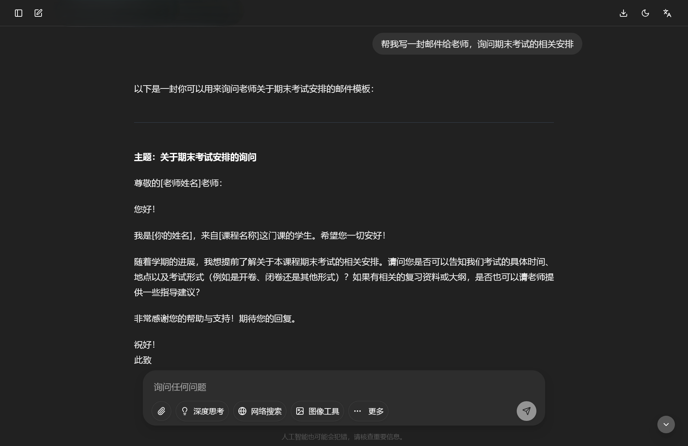
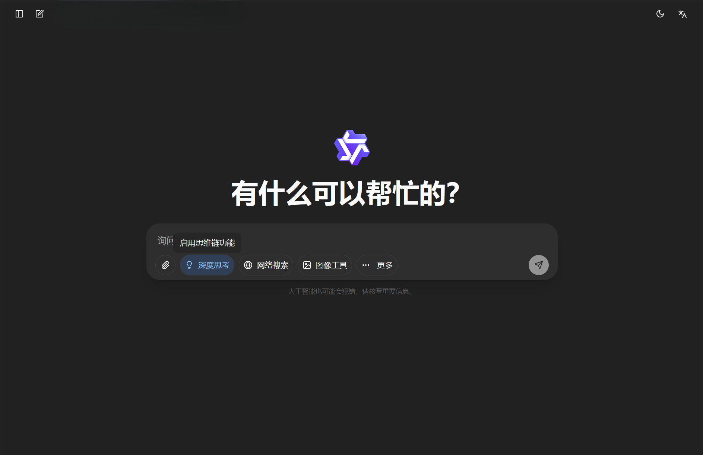
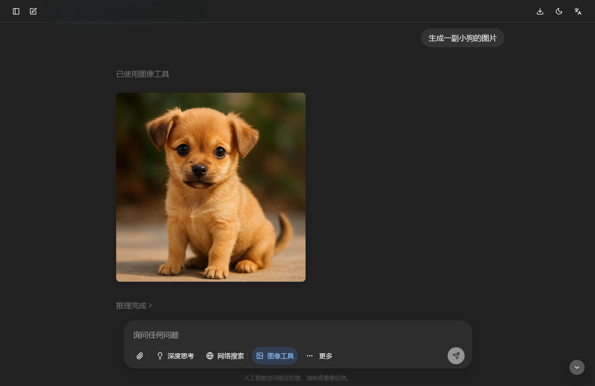
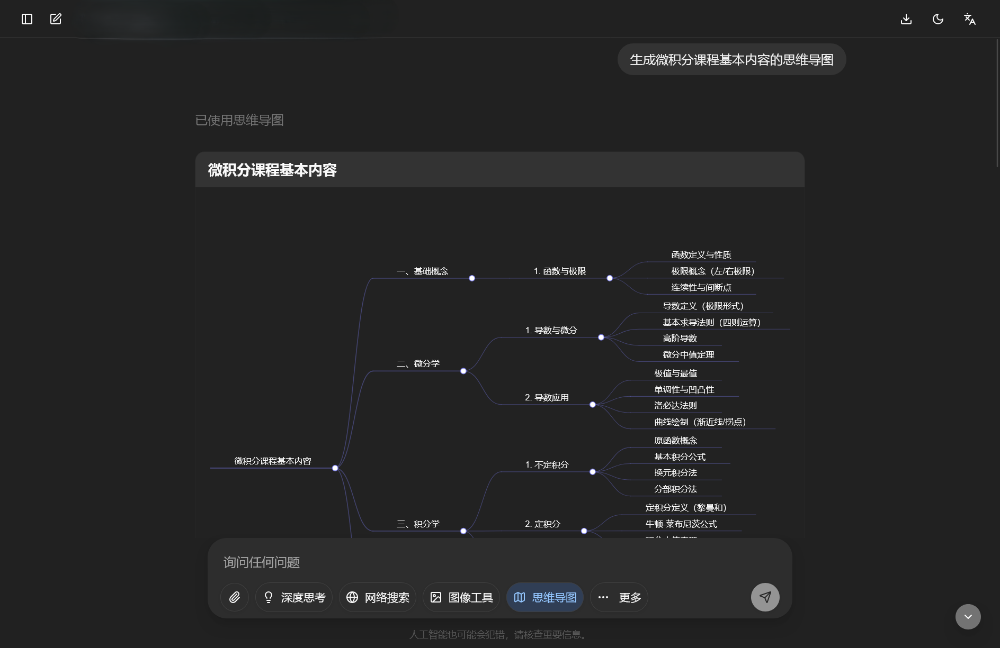
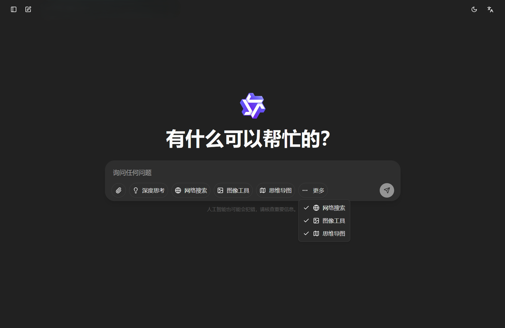

<!-- docs/docs/zh/manual/getting-started.md -->

# **用户使用手册**

!!! abstract "概述" 
    本文档为大学GPT服务平台的快速使用手册，系统介绍了平台的主要功能和使用方法。内容涵盖平台登录、基础对话、文件上传、深度思考、网络搜索、图像工具、思维导图等基础功能，以及AIGCD检测和AI小助手等扩展功能，帮助用户快速上手并高效使用平台。
--- 

## 🎯 初识GPT平台

GPT平台提供多种模型和服务，它可以识别理解并生成自然语言、代码、图片等内容，帮助您解决问题、进行写作或为您提供建议等。

### 登录

您可以使用学号（学生）/ 邮箱前缀（教职工）和相应密码登录大学 GPT 服务平台

### 第一个对话

您可以在聊天界面的文本框中提出问题或请求，等待模型回答，输入的语言应尽量表意明确且自然

??? tip "Tips: 终止回答"   
    - *模型回答过程中点击文本框最右侧按钮可终止回答*
    

!!! info "有关用量限制"
    每人每周可使用的Tokens有限制。**每个自然周第一次登录时重**置余额。各模型计费价格请参考：[模型信息](../models.md)。

    你可以在[账户信息](./account.md#_3)查看自己的用量和剩余用量情况。

---

## 📦 基础功能

这部分主要介绍GPT平台所提供的最基础的功能，满足绝大多数用户的日常使用需求

### **文件上传**

点击文本框最左侧的上传按钮，选择并上传受支持类型的文件，输入提示词后询问模型相关问题

### **深度思考**

点击`深度思考`按钮以打开此功能（其他功能同理），在文本框中输入相关问题并提问，即可看到回答中附带思考过程

??? "Tips: 工具简介"  
    - *指针悬停在按钮处可查看相应的功能简介*
    

### **网络搜索**

点击`网络搜索`按钮以打开此功能（其他功能同理），在文本框中输入相关问题并提问。回答上方为参考的网络资料

 
### **图像工具**

点击`图像工具`按钮以打开此功能（其他功能同理），在文本框中输入相关问题并提问

### **思维导图**

点击`思维导图`按钮以打开此功能（其他功能同理），在文本框中输入相关要求

??? "Tips: 隐藏/固定工具"  
    - *点击按钮 `更多`，勾选各工具可使其固定在文本框下方*
    

---

## 🚀 扩展功能

### **AIGCD**

AIGCD 是 AI 生成内容检测工具。您可以上传文件或粘贴文本以检查其内容有多少比例**可能**是由 AI 生成的，右侧会展示检测结果

!!! tip "小贴士"

    - 如果想要同时检测多份文件，可以点击右上角按钮开启`批量模式`

    
