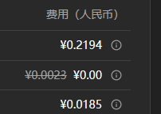

<!-- docs/docs/zh/manual/quota.md -->

# 配额池

!!! abstract "概述"
    配额池是大学GPT服务平台的核心资源管理功能，通过精细化的计费控制和资源访问管理，帮助用户合理规划AI服务使用成本，确保服务的高效和可持续利用。

## 核心功能

配额池主要提供两大核心功能：

### 计费管理
- **精确扣费**: 根据实际使用的 AI 模型和 Token 消耗进行实时精确计费
- **余额控制**: 每个配额池都有独立的余额额度，超出额度将无法继续使用
- **成本追踪**: 详细记录每次对话的费用明细，便于成本分析和预算控制

### 资源访问控制
- **权限隔离**: 不同配额池可设置不同的模型访问权限和使用限制
- **灵活分配**: 支持按用户、部门或项目分配不同的配额池资源
- **使用监控**: 实时监控配额使用情况，及时预警和调整

## 配额池类型

### 个人账户
个人账户是个人使用的配额池，目前学生的个人账户不可用，全职员工可以使用。

- 每周固定额度  
- 每周五的1点自动重置额度

### 配额池
目前全职员工没有配额池，学生可以使用 ```Students Pool```配额池。  

- **团体、学院、部门、科研团队若有团队预算使用模型或高级模型使用需求，可以与资讯科技服务处联系。**  
  
对于学生使用的```Students Pool```配额池，每周五1点自动恢复额度。


!!! tip "配额用完了怎么办？"  
    如果配额用完，你可以：  
    
    1. **使用免费模型**: 切换到 Qwen3-MoE（本地版），它是免费的，不消耗配额  
    2. **等待刷新**: 全职员工个人账户和学生默认池```Students Pool```每周五1点自动恢复额度。或者其他配额池有相应的刷新时间设置，请询问相关配额池管理员  
    3. **切换可用的配额池**: 如果有其他可用的配额池

## 操作切换

用户可以根据需要切换不同的配额池，每个配额池有独立的余额和权限设置。

### 切换配额池
在个人中心或对话界面中选择目标配额池进行切换。


切换后系统将使用新配额池的余额进行计费，并遵循该配额池的权限规则。

!!! tip "切换提示"
    - 配额池切换即时生效，不影响当前正在进行的对话
    - 如果目标配额池余额不足，切换后可能无法继续使用某些功能
    - 建议根据使用场景选择合适的配额池，避免资源浪费

## 计费逻辑

### 如何计费
您可以在用户信息中查看计费详情，按照```最终费用 = 原始费用 × 折扣比例```收费。价格中划掉的价格为原始费用，其后为实际收费   

  

- **按Token计费**: 根据对话消耗的Token数量收费  
- **模型价格不同**: 高级模型比基础模型更贵  
- **实时扣费**: 每次对话后立即扣除费用，可以在 **个人中心-账户信息** 实时查看消费记录。其中呈现的是你在所有配额池的消费记录。 

!!! info "模型价格"
    您可以在[模型信息](../models.md)查看当前支持的模型和具体收费价格。


!!! info "费用查看"
    您可以在[个人中心-账户信息](./account.md#_3)查看当前配额池的使用情况和剩余额度。  

